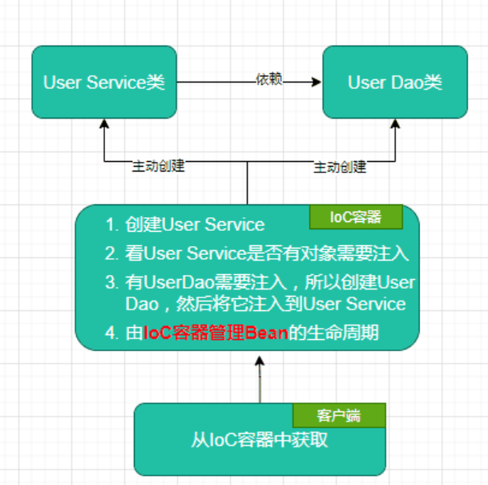

### 控制反转（IOC）

#### 什么是IOC

- IOC代表着 将我们自己主动创建对象转而变成程序去创建对象

  Q1：谁控制谁？

  A1：IOC控制了对象

  Q2：哪里反转了？

  A2：对象的获取反转了，原本是由我们主动去进行对象的注入，而现在容器去帮我们管控，注入

```java
//原来的对象创建
UserDao userDao = new UserDao();
UserServiceimpl userServiceImpl = new userServiceImpl();
userServiceImpl.setUserDao(userDao);
userServiceImpl.getUserInfo();
//容器帮我们管控后
UserServiceimpl userServiceImpl = contenxt.getBean("userServiceImpl",UserServiceimpl.class);
```



#### IOC和DI的关系

- 控制反转是通过依赖注入（DI）实现的，IOC是设计思想，DI是实现方式


#### IOC配置的三种方式

1. XML配置
   1. 配置xx.xml文件
   2. 声明命名空间和配置bean

```xml
<?xml version="1.0" encoding="UTF-8"?>
<beans xmlns="http://www.springframework.org/schema/beans"
       xmlns:xsi="http://www.w3.org/2001/XMLSchema-instance"
       xsi:schemaLocation="http://www.springframework.org/schema/beans
 http://www.springframework.org/schema/beans/spring-beans.xsd">
    <!-- services -->
    <bean id="userService" class="tech.pdai.springframework.service.UserServiceImpl">
        <property name="userDao" ref="userDao"/>
        <!-- additional collaborators and configuration for this bean go here -->
    </bean>
    <!-- more bean definitions for services go here -->
</beans>
```

2. Java配置

   1. 创建一个配置类， 添加@Configuration注解声明为配置类
   2. 创建方法，方法上加上@bean，该方法用于创建实例并返回，该实例创建后会交给spring管理，方法名建议与实例名相同（首字母小写）

   ```java
   @Configuration
   public class BeansConfig {
   
       /**
        * @return user dao
        */
       @Bean("userDao")
       public UserDaoImpl userDao() {
           return new UserDaoImpl();
       }
   
       /**
        * @return user service
        */
       @Bean("userService")
       public UserServiceImpl userService() {
           UserServiceImpl userService = new UserServiceImpl();
           userService.setUserDao(userDao());
           return userService;
       }
   }
   ```

3. 注解配置

   通过在类上加注解的方式，声明一个类去交给Spring管理，Spring会自动扫描带有@Component，@Controller，@Service，@Repository这四个注解的类

```java
@Service
public class UserServiceImpl {

    /**
     * user dao impl.
     */
    @Autowired
    private UserDao userDao;
}
```


#### 依赖注入的三种方式

1. setter注入

2. 构造函数注入

3. 注解注入

   - 包括使用@Autowired、@Resource，@Inject

     1. @Autowired

        ```java
        @Target({ElementType.CONSTRUCTOR, ElementType.METHOD, ElementType.PARAMETER, ElementType.FIELD, ElementType.ANNOTATION_TYPE})
        @Retention(RetentionPolicy.RUNTIME)
        @Documented
        public @interface Autowired {
          boolean required() default true;
        }
        //可以使用在以下地方
        @Target(ElementType.CONSTRUCTOR) #构造函数
        @Target(ElementType.METHOD) #方法
        @Target(ElementType.PARAMETER) #方法参数
        @Target(ElementType.FIELD) #字段、枚举的常量
        @Target(ElementType.ANNOTATION_TYPE) #注解
        ```

        默认是byType（通过类型）去进行自动注入，如果希望通过名字去进行注入则需要使用@Qualifier

        ```java
        @Autowired
        @Qualifier("userddDao")
        private UserDao userDao;
        ```

     2. @Resource

        ```java
        //可以用在以下地方
        @Target(ElementType.TYPE) #接口、类、枚举、注解
        @Target(ElementType.FIELD) #字段、枚举的常量
        @Target(ElementType.METHOD) #方法
        ```

        是根据名字去进行指定注入的

     3. @Inject

        用法基本和@AutoWired一致，通过@Named注解去进行byName注入