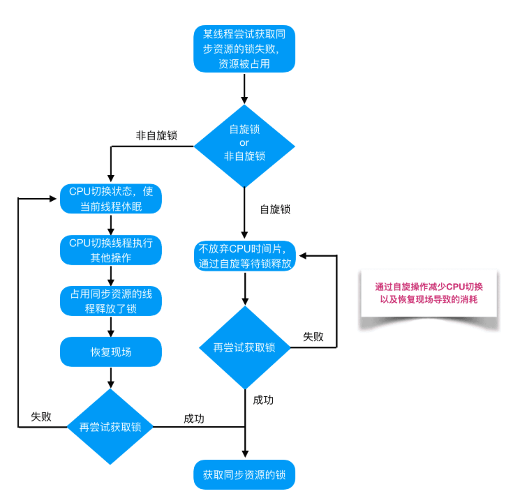

## JUC

### 为什么需要多线程？

- 为了合理利用CPU多核的高性能，提高任务处理速度

### 线程不安全的示例

```java
public class ThreadUnsafeExample {

    private int cnt = 0;

    public void add() {
        cnt++;
    }

    public int get() {
        return cnt;
    }
}
public static void main(String[] args) throws InterruptedException {
    final int threadSize = 1000;
    ThreadUnsafeExample example = new ThreadUnsafeExample();
    final CountDownLatch countDownLatch = new CountDownLatch(threadSize);
    ExecutorService executorService = Executors.newCachedThreadPool();
    for (int i = 0; i < threadSize; i++) {
        executorService.execute(() -> {
            example.add();
            countDownLatch.countDown();
        });
    }
    countDownLatch.await();
    executorService.shutdown();
    System.out.println(example.get());
}

997//结果总小于1000
```


### 并发出现问题的根源 

1. 可见性
   - 其他线程执行的结果没有给另外的线程看见，因此获取或修改的值不一致
2. 原子性
   - 一个操作或多个操作的执行不会被任何因素打断，比如上述cnt++这个案例，实际cnt++氛围三个指令
     1. 取到当前cnt的值
     2. 对当前cnt的值+1
     3. 把+1后的值赋值给cnt
   - 如果这三个操作不是一起执行的就会有问题
3. 有序性
   - 程序执行的顺序按照代码的先后顺序执行，因为编译器和处理器为了提高性能，常常会为在单线程不影响执行结构的指令进行重排序，而不是按我们写的顺序去执行，在多线程下就会有可能出现问题

### Java是怎么解决并发问题的

#### 1. final 对象

- 不可变就没有并发问题

#### 2. volatile 

- (解决了可见性和重排序)

- 防重排序

一个最经典的例子来分析重排序问题。并发环境下的单例实现方式，我们通常可以采用双重检查加锁(DCL)的方式来实现。其源码如下：

```java
public class Singleton {
    public static volatile Singleton singleton;
    /**
     * 构造函数私有，禁止外部实例化
     */
    private Singleton() {};
    public static Singleton getInstance() {
        if (singleton == null) {
            synchronized (singleton.class) {
                if (singleton == null) {
                    singleton = new Singleton();
                }
            }
        }
        return singleton;
    }
}
```

例化一个对象其实可以分为三个步骤：

- 分配内存空间。
- 初始化对象。
- 将内存空间的地址赋值给对应的引用。

但是由于操作系统可以`对指令进行重排序`，所以上面的过程也可能会变成如下过程：

- 分配内存空间。
- 将内存空间的地址赋值给对应的引用。
- 初始化对象

如果是这个流程，多线程环境下就可能将一个未初始化的对象引用暴露出来，从而导致不可预料的结果。因此，为了防止这个过程的重排序，我们需要将变量设置为volatile类型的变量。

- 实现可见性

可见性问题主要指一个线程修改了共享变量值，而另一个线程却看不到。引起可见性问题的主要原因是每个线程拥有自己的一个高速缓存区——线程工作内存。volatile关键字能有效的解决这个问题，我们看下下面的例子，就可以知道其作用：

```java
public class TestVolatile {
    private static boolean stop = false;

    public static void main(String[] args) {
        // Thread-A
        new Thread("Thread A") {
            @Override
            public void run() {
                while (!stop) {
                }
                System.out.println(Thread.currentThread() + " stopped");
            }
        }.start();

        // Thread-main
        try {
            TimeUnit.SECONDS.sleep(1);
            System.out.println(Thread.currentThread() + " after 1 seconds");
        } catch (InterruptedException e) {
            e.printStackTrace();
        }
        stop = true;
    }
}
```

执行输出如下

```bash
Thread[main,5,main] after 1 seconds

// Thread A一直在loop, 因为Thread A 由于可见性原因看不到Thread Main 已经修改stop的值
```

可以看到 Thread-main 休眠1秒之后，设置 stop = ture，但是Thread A根本没停下来，这就是可见性问题。如果通过在stop变量前面加上volatile关键字则会真正stop:

```bash
Thread[main,5,main] after 1 seconds
Thread[Thread A,5,main] stopped

Process finished with exit code 0
```

- 实现原理：
  - volatile其本质是通过内存屏障是实现可见性和重排序，就是在jvm编译生成子节码的时候，会额外生成cpu指令，去让处理器对某些操作不进行重排序
  - 可见性则是告诉cpu，在修改了某个值的时候，会将对应的值直接写到系统内存，而不是放到缓存中，并且告诉其他缓存的值已过期，需要从系统内存中拿到新值

#### 3.  synchronized 

- （解决可见性和原子性）


### 线程安全的实现方法

1. 互斥同步

   - synchronized和reentrantlock

2. 非互斥同步

   - cas
     - 需要三个操作数，内存地址V，旧值A和新值B，只有当内存地址V的值等于A，才将其更新为B

3. 无同步方案

   - 栈封闭:当变量只是个局部变量只在线程内定义使用和计算，就是安全的

   ```java
   public class StackClosedExample {
       public void add100() {
           int cnt = 0;
           for (int i = 0; i < 100; i++) {
               cnt++;
           }
           System.out.println(cnt);
       }
   }
   public static void main(String[] args) {
       StackClosedExample example = new StackClosedExample();
       ExecutorService executorService = Executors.newCachedThreadPool();
       executorService.execute(() -> example.add100());
       executorService.execute(() -> example.add100());
       executorService.shutdown();
   }
   ```

   - ThreadLocal

     - ThreadLocal的本质就是一个通过一个Map去存值，Key是线程地址/ID，value是对应的值，因此只会取到自己当前线程的值

     

     

     

     

     

### 线程的状态

1. New：线程创建后尚未启动
2. Runing:线程正在运行，或许正在等待时间片
3. blocking：等待获取一个排他锁
4. waiting:无限期等待，等待被唤醒，比如notify
5. timed waiting：有限时间等待，比如Thread.sleep()
6. Terminated:死亡:线程任务结束之后自动销毁或者发生了异常而结束


### 线程的使用方式

1. 实现Runnable接口

   - 实现run方法，通过Thread调用start方法来启动线程

     ```java
     public class MyRunnable implements Runnable {
         public void run() {
             // ...
         }
     }
     public static void main(String[] args) {
         MyRunnable instance = new MyRunnable();
         Thread thread = new Thread(instance);
         thread.start();
     }
     ```

2. 实现Callable接口

   与 Runnable 相比，Callable 可以有返回值，返回值通过 FutureTask 进行封装。

   ```java
   public class MyCallable implements Callable<Integer> {
       public Integer call() {
           return 123;
       }
   }
   public static void main(String[] args) throws ExecutionException, InterruptedException {
       MyCallable mc = new MyCallable();
       FutureTask<Integer> ft = new FutureTask<>(mc);
       Thread thread = new Thread(ft);
       thread.start();
       System.out.println(ft.get());
   }
   ```

3. 继承 Thread 类

同样也是需要实现 run() 方法，因为 Thread 类也实现了 Runable 接口。

当调用 start() 方法启动一个线程时，虚拟机会将该线程放入就绪队列中等待被调度，当一个线程被调度时会执行该线程的 run() 方法。

```java
public class MyThread extends Thread {
    public void run() {
        // ...
    }
}
public static void main(String[] args) {
    MyThread mt = new MyThread();
    mt.start();
}
```


### 悲观锁和乐观锁

- 悲观锁
  - 其实就是总是认为使用数据的时候一定有别的线程来修够资源，因此获取数据的时候来加锁，处理完才把锁释放让其他线程去进行处理，比如synchronized关键字

- 乐观锁
  - 就是认为在使用数据的过程中别的线程不会来修改资源，因此在最后更新数据的时候才去判断数据有没有被更新，如果还是原来的数据就去更新，否则进行重试或者报错


### 自旋锁

- 阻塞或者唤醒一个线程需要去进行线程的切换，线程切换的代码是巨大的，自旋锁就是在获取不到锁的时候会再次尝试尝试锁，直到尝试到指定次数还没获取到锁才会将线程挂起
- 好处：如果线程持有锁的时间很短，能减少线程切换所带来的代价
- 坏处：如果锁是持有很久的，那么自旋的线程只会浪费时间



### 公平锁和非公平锁

- 公平锁
  - 就是获取锁的线程看看有没有其他线程在获取锁，有的话则会去排队、根据获取锁的顺序去排队获取锁，不会进行插队
  - 缺点是线程的挂起和唤醒会增加开销
- 非公平锁
  - 当一个线程要获取锁的时候，首先尝试去获取锁，如果这个时候刚好锁释放了，那么该线程就插队成功，直接获取锁了，如果获取不到再去排队。
  - 优点：减少了线程切换的开销
  - 缺点：在排队的线程可能会被饿死


### 可重入锁和非可重入锁

- 可重入锁：就是当前线程拿到锁后，如果代码中再拿同一把锁时不会阻塞
- 不可重入锁：线程拿到锁后，再去尝试拿同一把锁也会阻塞，并且发生死锁


### 共享锁和排他锁

- 共享锁：该锁可以被多个线程持有，但是只有读权限
- 排他锁：只有一个线程可以持有该锁


### Synchronized

#### 关键点

1. 一把锁只能被一个线程持有
2. 锁的对象是对锁实例的，但当Synchronized修饰在类或者static方法时，所有对象共用一把锁
3. Synchronized修饰的方法，无论执行成功还是异常，都会释放锁

- 对象锁：
  - 包括方法锁(默认锁对象为this,当前实例对象)和同步代码块锁(自己指定锁对象)
  - 代码块形式：手动指定锁定对象，也可是是this,也可以是自定义的锁

- 示例1

```java
public class SynchronizedObjectLock implements Runnable {
    static SynchronizedObjectLock instance = new SynchronizedObjectLock();

    @Override
    public void run() {
        // 同步代码块形式——锁为this,两个线程使用的锁是一样的,线程1必须要等到线程0释放了该锁后，才能执行
        synchronized (this) {
            System.out.println("我是线程" + Thread.currentThread().getName());
            try {
                Thread.sleep(3000);
            } catch (InterruptedException e) {
                e.printStackTrace();
            }
            System.out.println(Thread.currentThread().getName() + "结束");
        }
    }

    public static void main(String[] args) {
        Thread t1 = new Thread(instance);
        Thread t2 = new Thread(instance);
        t1.start();
        t2.start();
    }
}
```

输出结果：

```java
我是线程Thread-0
Thread-0结束
我是线程Thread-1
Thread-1结束
```

- 示例2

```java
public class SynchronizedObjectLock implements Runnable {
    static SynchronizedObjectLock instance = new SynchronizedObjectLock();
    // 创建2把锁
    Object block1 = new Object();
    Object block2 = new Object();

    @Override
    public void run() {
        // 这个代码块使用的是第一把锁，当他释放后，后面的代码块由于使用的是第二把锁，因此可以马上执行
        synchronized (block1) {
            System.out.println("block1锁,我是线程" + Thread.currentThread().getName());
            try {
                Thread.sleep(3000);
            } catch (InterruptedException e) {
                e.printStackTrace();
            }
            System.out.println("block1锁,"+Thread.currentThread().getName() + "结束");
        }

        synchronized (block2) {
            System.out.println("block2锁,我是线程" + Thread.currentThread().getName());
            try {
                Thread.sleep(3000);
            } catch (InterruptedException e) {
                e.printStackTrace();
            }
            System.out.println("block2锁,"+Thread.currentThread().getName() + "结束");
        }
    }

    public static void main(String[] args) {
        Thread t1 = new Thread(instance);
        Thread t2 = new Thread(instance);
        t1.start();
        t2.start();
    }
}
```

输出结果：

```html
block1锁,我是线程Thread-0
block1锁,Thread-0结束
block2锁,我是线程Thread-0　　// 可以看到当第一个线程在执行完第一段同步代码块之后，第二个同步代码块可以马上得到执行，因为他们使用的锁不是同一把
block1锁,我是线程Thread-1
block2锁,Thread-0结束
block1锁,Thread-1结束
block2锁,我是线程Thread-1
block2锁,Thread-1结束
```

- 方法锁形式：synchronized修饰普通方法，锁对象默认为this

```java
public class SynchronizedObjectLock implements Runnable {
    static SynchronizedObjectLock instance = new SynchronizedObjectLock();

    @Override
    public void run() {
        method();
    }

    public synchronized void method() {
        System.out.println("我是线程" + Thread.currentThread().getName());
        try {
            Thread.sleep(3000);
        } catch (InterruptedException e) {
            e.printStackTrace();
        }
        System.out.println(Thread.currentThread().getName() + "结束");
    }

    public static void main(String[] args) {
        Thread t1 = new Thread(instance);
        Thread t2 = new Thread(instance);
        t1.start();
        t2.start();
    }
}
```

输出结果：

```html
我是线程Thread-0
Thread-0结束
我是线程Thread-1
Thread-1结束
```

- 类锁：指synchronize修饰静态的方法或指定锁对象为Class对象

1. synchronize修饰静态方法

- 示例1

```java
public class SynchronizedObjectLock implements Runnable {
    static SynchronizedObjectLock instance1 = new SynchronizedObjectLock();
    static SynchronizedObjectLock instance2 = new SynchronizedObjectLock();

    @Override
    public void run() {
        method();
    }

    // synchronized用在普通方法上，默认的锁就是this，当前实例
    public synchronized void method() {
        System.out.println("我是线程" + Thread.currentThread().getName());
        try {
            Thread.sleep(3000);
        } catch (InterruptedException e) {
            e.printStackTrace();
        }
        System.out.println(Thread.currentThread().getName() + "结束");
    }

    public static void main(String[] args) {
        // t1和t2对应的this是两个不同的实例，所以代码不会串行
        Thread t1 = new Thread(instance1);
        Thread t2 = new Thread(instance2);
        t1.start();
        t2.start();
    }
}
```

输出结果：

```html
我是线程Thread-0
我是线程Thread-1
Thread-1结束
Thread-0结束
```

- 示例2

```java
public class SynchronizedObjectLock implements Runnable {
    static SynchronizedObjectLock instance1 = new SynchronizedObjectLock();
    static SynchronizedObjectLock instance2 = new SynchronizedObjectLock();

    @Override
    public void run() {
        method();
    }

    // synchronized用在静态方法上，默认的锁就是当前所在的Class类，所以无论是哪个线程访问它，需要的锁都只有一把
    public static synchronized void method() {
        System.out.println("我是线程" + Thread.currentThread().getName());
        try {
            Thread.sleep(3000);
        } catch (InterruptedException e) {
            e.printStackTrace();
        }
        System.out.println(Thread.currentThread().getName() + "结束");
    }

    public static void main(String[] args) {
        Thread t1 = new Thread(instance1);
        Thread t2 = new Thread(instance2);
        t1.start();
        t2.start();
    }
}
```

输出结果：

```html
我是线程Thread-0
Thread-0结束
我是线程Thread-1
Thread-1结束
```

2. synchronized指定锁对象为Class对象

```java
public class SynchronizedObjectLock implements Runnable {
    static SynchronizedObjectLock instance1 = new SynchronizedObjectLock();
    static SynchronizedObjectLock instance2 = new SynchronizedObjectLock();

    @Override
    public void run() {
        // 所有线程需要的锁都是同一把
        synchronized(SynchronizedObjectLock.class){
            System.out.println("我是线程" + Thread.currentThread().getName());
            try {
                Thread.sleep(3000);
            } catch (InterruptedException e) {
                e.printStackTrace();
            }
            System.out.println(Thread.currentThread().getName() + "结束");
        }
    }

    public static void main(String[] args) {
        Thread t1 = new Thread(instance1);
        Thread t2 = new Thread(instance2);
        t1.start();
        t2.start();
    }
}
```

输出结果：

```html
我是线程Thread-0
Thread-0结束
我是线程Thread-1
Thread-1结束
```

------

#### 底层原理

- 通过`monitorenter`和`monitorexit`去获取锁和释放锁
- monitor计数器为0，证明这把锁没有被其他线程获取，则去使用monitorenter指令让monitor计数器+1，如果后续有可重入的场景，则再次在原来的基础上+1，释放锁的时候调用monitorexit去使计数器-1，知道计数器为0了才是真正的释放锁
- 如果monitor计数器不为0，则证明锁被其他线程获取了，等待锁的释放

#### 锁升级

- 过程：无锁->偏向锁->轻量级锁->重量级锁
  1. 无锁：没有访问共享资源，不需要锁
  2. 偏向锁:当一个线程拿锁的时候，就会升级成偏向锁，如果在锁释放后才有线程去拿这个锁，或者还是当前去拿锁，就还会是偏向锁；总结：没有其他线程竞争这个锁
  3. 轻量级锁：当一个线程持有锁，其他线程来竞争锁的时候,这个锁就会升级成轻量级锁，并且会去自旋尝试获取锁
  4. 重量级锁：如果线程自旋达到最大次数还没有获取到锁的话，就会升级成重量级锁，线程阻塞，等待锁释放唤醒


### CAS

- 全称为Compare And Swap，其本质是一条cpu的原子指令，是硬件实现的;其需要三个参数，对象的引用，旧值，新值，核心就是比较对象是否还等于旧值，如果等于的话就将新值赋值，是一种乐观锁的思想

- 如果引用不等于旧值的话，就会进行自旋重试

- CAS的问题

  1. 但是但这单单比较值会有ABA问题

  - ABA问题就是如果一个引用从A变为B然后再变成A。
  - 解决ABA问题可以通过再加入一个版本号去进行比较，每次更新都会更新这个版本号，只有当版本好没有变化的时候才去进行更新

  2. 自旋开销大


### AQS


