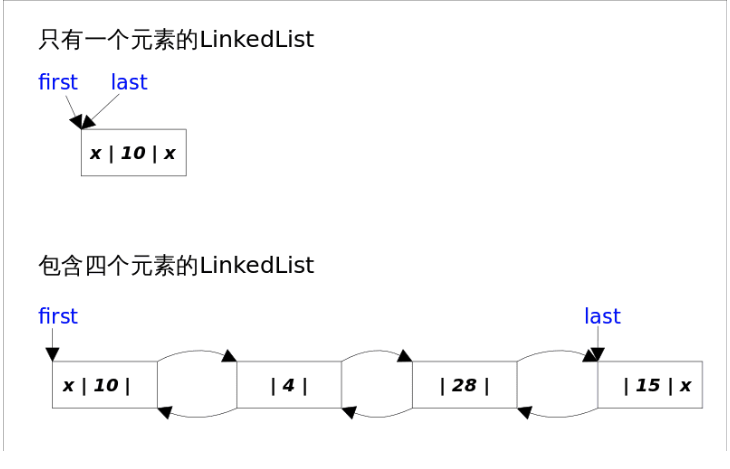
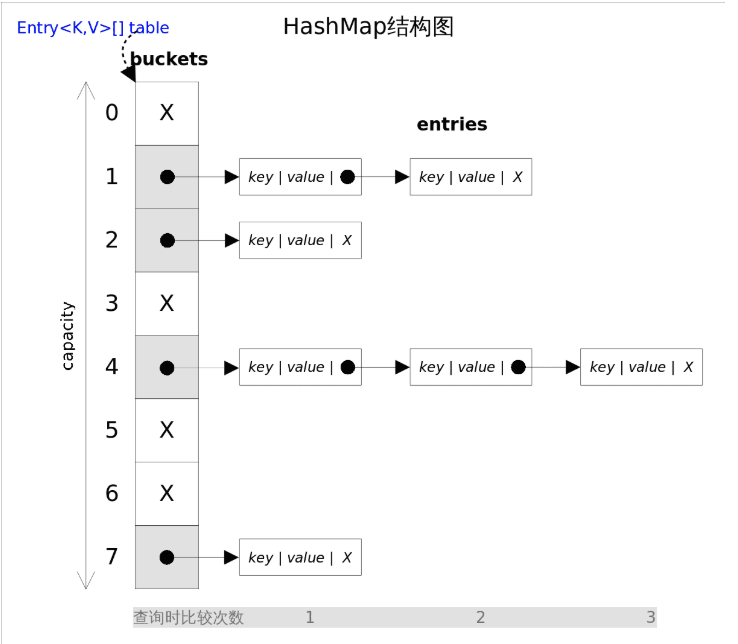
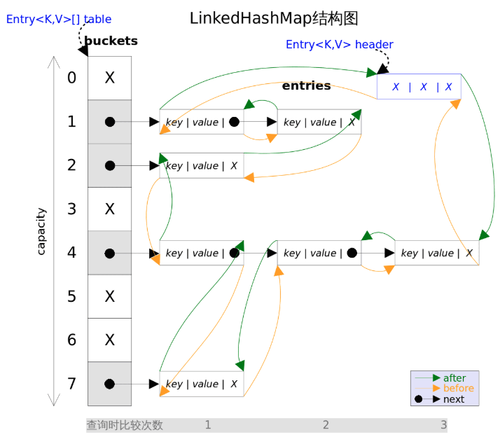

## 集合

### ArrayList

- 概述
  - ArrayList实现了list接口，是顺序容器，元素存放的数据和放进去的顺序相同，允许存入`null`元素，底层通过**数组**实现
  - 每个ArrayList会有一个容量，当容量不足的时候，会进行自动扩容。默认容量是**10**,扩容倍数是1.5当前容量的1.5倍
    - new一个ArrayList的时候不会给list分配容量，即一开始是空数组，只有开始往里面添加元素的时候，才会将其初始化为**10**

- 自动扩容：

  - 每次往数组添加元素的时候，会去检查添加后的元素个数是否超出当前数组的长度

  - 自动扩容的本质是是新建一个扩容后的数组，然后将原数组的数据移动到新数组中去

- Add方法

  - add（element）会先检查数组空间检查，然后往数组的最后面添加元素，因此时间复杂度为O（1）
  - add(index, element)  需要先对元素进行移动，然后再完成插入，因此该方法有`线性`的时间复杂度

- get方法

  - 直接取对应位置的数组数据即可，因此复杂度也有O(1)

### LinkedList

- 概述

  - 同时实现了List接口和Deque接口，他既可以看作是一个顺序容器，也可以看作是一个Queue,或者一个stack

  - 底层是通过**双向链表**实现的，用first指针和last指针指向第一个和最后一个元素

  

- remove
  - 只会删除第一个符合的元素，然后停止遍历，removeIf会删除所有符合条件的元素
- add
  - add（E e）直接在后面添加元素，因此时间复杂度为O(1)
  - Add(E e,int index) 往指定位置添加，因为需要查找到对应位置，因此时间复杂度为O(n)，如果index==size的时候，那就会等同于add(E e), **会去判断index是靠近前端还是靠近后端去选择更短的路径去找**


### HashMap

- 概述

  - 是无序的，遍历的原理是先遍历数组，然后数组中如果有链表再去遍历链表中的元素

  - 在Jdk1.7是通过数组+链表的方式实现，1.8以后是通过数组+链表+红黑树的方式实现（在链表长度为8的时候，转换为红黑树）

  - HashMap允许放入key为null和value为null的元素
  - 初始容量：默认是`20`，决定了数组的大小;扩容因子:默认是`0.75`决定了扩容的时机;当数组容量达到**扩容因子X当前容量**的阈值，就会触发自动扩容;
  - 第一次put的时候在会去初始化数组，new出来的时候会是个空数组，将初始化延迟到使用的时候



- 容量必须是2的n次方，这是为了计算数组的bucket的位置时效率更高

  - 常规方法是hash(key) % table.length，而为了更高的效率，使用了hash(k) & table.length -1的方式去取位置
  - 原理是2的n次方-1 在二进制中，低位会全为1，比如4的二进制是100，减1后会是011，在&运算中，和1相&的数会是他本身，和0相&的数一定会为0，因此hash(k) & table.length -1就会将高位全部抹掉，剩下的就是余数

- 自动扩容：数组容量达到**扩容因子X当前容量**的阈值，就会触发自动扩容，每次扩容的容量是当前容量`两倍`，然后将旧数组的数据迁移到新数组中

  - 在JDK1.7，当遇到某个entry中有链表的时候，就会采用`头插法`去进行数据迁移，就是从第一个元素开始遍历，然后插入到逐个插入新数组当中，也就是原本是A->B->C,迁移完后会变成C->B->A

  - 这样子会导致扩容后的链表中的元素顺序跟扩容前是相反的，并且**并发场景中会造成环形链表的问题**导致死循环，CPU100%

  - 数组扩容迁移的源码：

    ```javascript
    //newTable表示新创建的扩容后的数组
    //rehash表示元素是否需要重新计算哈希值
    void transfer(Entry[] newTable, boolean rehash) {
        //记录新数组的容量
        int newCapacity = newTable.length;
        //遍历原数组的桶位置
        for (Entry<K,V> e : table) {
            //如果桶位置不为空，则遍历链表的元素
            while(null != e) {
                //next表示原数组链表的下一个节点
                Entry<K,V> next = e.next;
                
                //确定元素在新数组的索引位置
                if (rehash) {
                    e.hash = null == e.key ? 0 : hash(e.key);
                }
                int i = indexFor(e.hash, newCapacity);
                //头插法，新元素始终指向新数组对应桶位置的第一个元素
                e.next = newTable[i];
                
                //新插入的元素成为桶位置的第一个元素
                newTable[i] = e;
                
                //遍历原数组链表的下一个元素
                e = next;
            }
        }
    }
    ```

    

    1. 假设有两个线程A，B都去进行了扩容，原hashMap有个slot的链表为A->B-C
    2. 线程A、B拿到第一个数组的头节点和next节点的值，也就是现在线程A和B中 e=A，e.next=B
    3. 然后线程A先进行迁移，线程B因为拿不到时间片的关系被阻塞了
    4. 线程A完成迁移，新数组中链表为C->B->A->null
    5. 然后线程B开始迁移,这个时候他会在他自己的新数组去进行链表迁移，然后会拿原链表的next指向新链表的头节点，因为还是空，所以指向null,此时新链表是A->null
    6. 然后开始迁移下一个节点，现在线程b中，e=B e.next=B.next,现在B.next指向的是A，然后现在把B.next=A，现在新链表是B->A->null
    7. 然后回旧数组的链表指向，e=A ; e.next=A.next，也就是 e.next=null，现在A.next要指向新链表的头节点，所以变成A->B->A>null，此时，已经形成了环形链表，然后e.next为空，扩容完成。
    8. 当要寻找C这个key的value的时候，就会产生死循环

  - 而jdk1.8使用了尾插法避免了这个问题,扩容前后的链表顺序会是一致

  - 头插法插入效率高，尾插法因为需要遍历到链表的最后一个再去插入


### HashSet

- 支持快速查找，基于HashMap实现，其内部其实就是运用了hashMap，key存的就是传进来的值，value是一个固定的常量

### LinkedHashMap

- 本质就是HashMap和linkedList的结合体，每个entry有个双向链表去进行关联，因此遍历linkedhashMap是有序的
- 遍历的时候直接遍历heder指向的双向链表，而不需要遍历数组了



- LinkedHashMap的经典用法

  - 实现FIFO(先进先出)替换策略的缓存

    1. LinkedHashMap有一个子类方法`protected boolean removeEldestEntry(Map.Entry<K,V> eldest)`，每次put或者putALL的时候会去调用这个方法，该方法的作用是告诉Map是否要删除“最老”的Entry，如果返回true的话就会删除，最老的entry就是最早插入的entry

    2. 因此我们只需要重写这个方法就可以，让他在我们想要的条件下返回true，比如

       ```java
       /** 一个固定大小的FIFO替换策略的缓存 */
       class FIFOCache<K, V> extends LinkedHashMap<K, V>{
           private final int cacheSize;
           public FIFOCache(int cacheSize){
               this.cacheSize = cacheSize;
           }
           // 当Entry个数超过cacheSize时，删除最老的Entry
           @Override
           protected boolean removeEldestEntry(Map.Entry<K,V> eldest) {
              return size() > cacheSize;
           }
       }
       ```

  - 实现LRU(最近最少使用)

    1. LinkedHashMap的构造函数中有个参数为accessOrder，为true的话就会按照访问顺序进行排序，默认为flase，就是按照插入顺序进行排序
    2. accessOrder为true的时候removeEldestEntry这个方法返回true的时候就会删除最近最少使用的元素

    ```java
    public class InsertOrderCache<K, V> extends LinkedHashMap<K, V> {
        private final int capacity;
    
        public InsertOrderCache(int capacity) {
            super(capacity, 0.75f, false); // accessOrder=false，按插入顺序排序
            this.capacity = capacity;
        }
    
        @Override
        protected boolean removeEldestEntry(Map.Entry<K, V> eldest) {
            return size() > capacity; // 超出容量时，移除最早插入的元素
        }}
    ```

### LinkedHashSet

- 也是对LinkedHashMap进行简单的包装，对*LinkedHashSet*的函数调用都会转换成合适的*LinkedHashMap*方法


### TreeMap

-  *TreeMap*实现了*SortedMap*接口，也就是说会按照`key`的大小顺序对*Map*中的元素进行排序，`key`大小的评判可以通过其本身的自然顺序(natural ordering)，也可以通过构造时传入的比较器(Comparator)
- TreeMap\底层通过红黑树(Red-Black tree)实现


### ConcurrentHashMap

