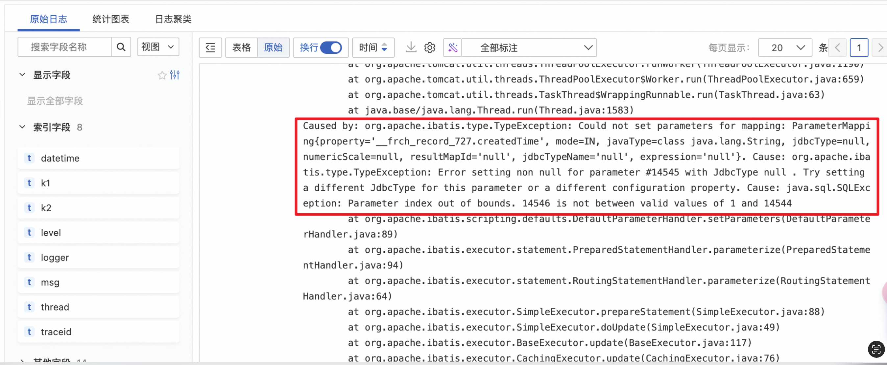
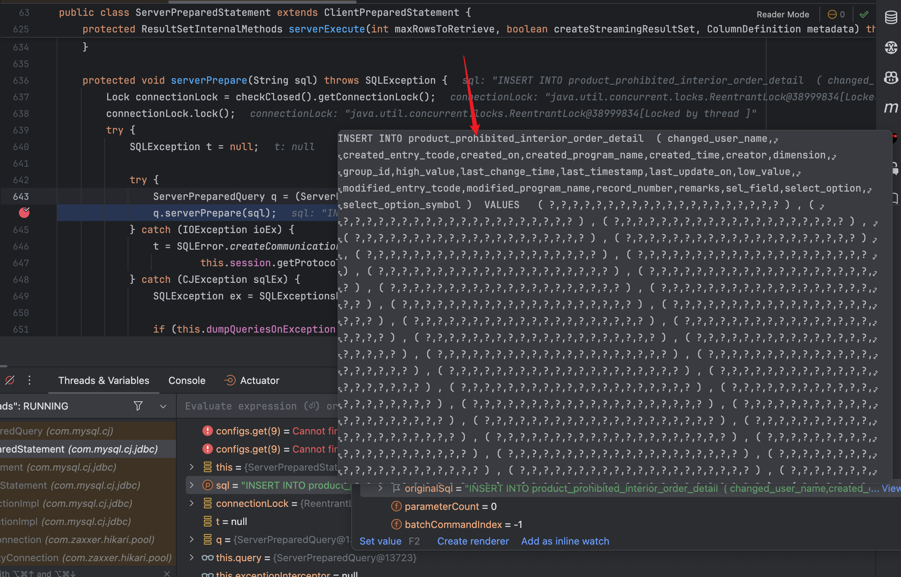
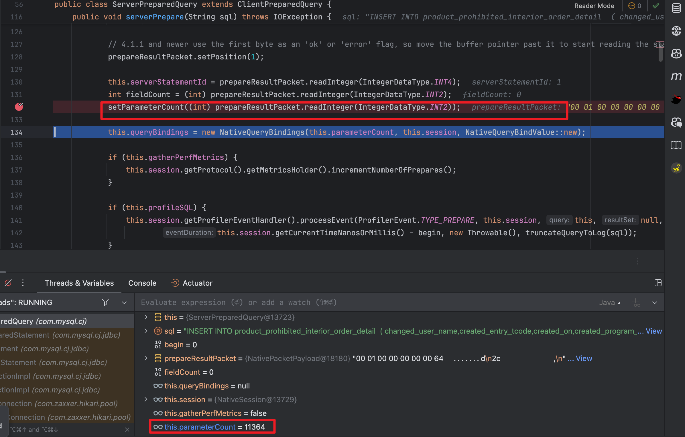

### InsertList超出限制


#### 背景：

- 商品的禁配解禁业务，上游负责建禁配解禁单据，资料中台负责接收单据并进行解析计算；

#### 问题：

- 在测试造数据达到产品设计的极端情况下，会一次性传入500张单，每个单的明细最大会有4000条数据

### 事故现象:

- 插入数据失败，但报错十分奇怪




### 排查问题：

- 拿到入参在本地去进行调试，发现是在预编译sql的时候报了越界


- **这里有一个奇怪的问题：为什么paramCount是11364？**，这个数字是从哪来的，他代表着什么，于是带着好奇心去继续寻找答案

- 这里我用的是tk-mybatis的insertList，其本质是用sqlProvider去进行sql拼接，查看preparedStatment观察到拼接后的sql也没什么问题，占位符和参数的数量也对得上

  

那就接着往下看



- 在这里就发现这里的是把sql发送给服务端去进行预编译，这里设置的parameterCount是占位符的数量，也就是sql中`?`的数量，但是这里引申了另外一个奇怪的问题，我这里的占位符数量应该是大约3500条数据 X 20个字段=70000 ，远远不等于11364.. 
- 一开始猜测这个11364是服务端最大可承受的长度数量，**减少了数据长度到2000就可以正常插入了**
- 但再回到一开始的sls报错显示的是14545，那个时候传的是4000条数据 X 20个字段=80000，这里我们使用的是阿里云的ADB，具体为何他会返回这个奇怪的数字这里不作深究了


###  问题根源：

- 一开始之前开发写的代码只根据单分批，每个单插入一次数据，因此会一次性插入4000条数据，每条数有20个字段

### 解决方法：

- 解决方法很简单，就是根据单分批的基础上，插入明细的数据也进行分批，每次插入2000条就可以了

```java
            Lists.partition(dto, pushSize)
                    .forEach(e -> xxxmapper.insertList(e));
```


- 并且发现这里原来单分批只是一个单一个单插入，这个项目使用了`JDK21`，因此这里给他提提速，开虚拟线程进行多线程插入

#### 再遇问题：

- 假设每个单4000条数据，500个单，不加限制的开虚拟线程去进行插入的话，每2000条明细数据去进行插入，那就是瞬间会有4000/2000 * 500 =1000 个请求去建立数据库链接并发送请求，刚好**ADB本身是个数仓型数据库，不适合高并发**，因此这样子无脑开虚拟线程也会有问题
- 那方法也简单嘛，就是让他有节制的去创建虚拟线程，由于虚拟线程本身没有和平台线程一样有`newFixedThreadPool`方法，那就自己通过``信号量``去进行虚拟线程的创建,实现`Executor, AutoCloseable`接口和execute和close方法即可

```java
public class LimitedVirtualThreadExecutor implements Executor, AutoCloseable {

    private final ExecutorService executor;
    private final Semaphore semaphore;

    public LimitedVirtualThreadExecutor(int maxThreads) {
        this.executor = Executors.newVirtualThreadPerTaskExecutor();
        this.semaphore = new Semaphore(maxThreads);
    }

    @Override
    public void execute(@NonNull Runnable command) {
        try {
            semaphore.acquire();
            executor.submit(() -> {
                try {
                    command.run();
                } finally {
                    semaphore.release();
                }
            });
        } catch (InterruptedException e) {
            Thread.currentThread().interrupt();
        }
    }

    @Override
    public void close() {
        executor.close();
    }
}
```

使用固定数量的虚拟线程去执行任务：

```java
    try (LimitedVirtualThreadExecutor limitedVirtualThreadExecutor = new LimitedVirtualThreadExecutor(threadSize)) {
    limitedVirtualThreadExecutor.execute(() -> {
      //任务逻辑
    });
    }
```


#### 


