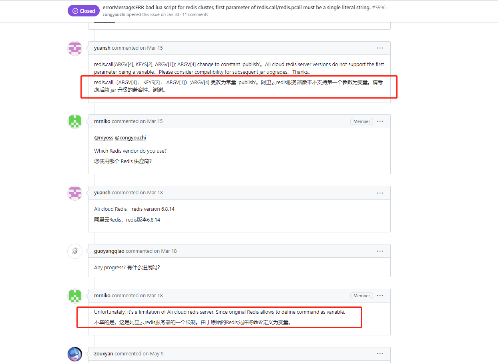
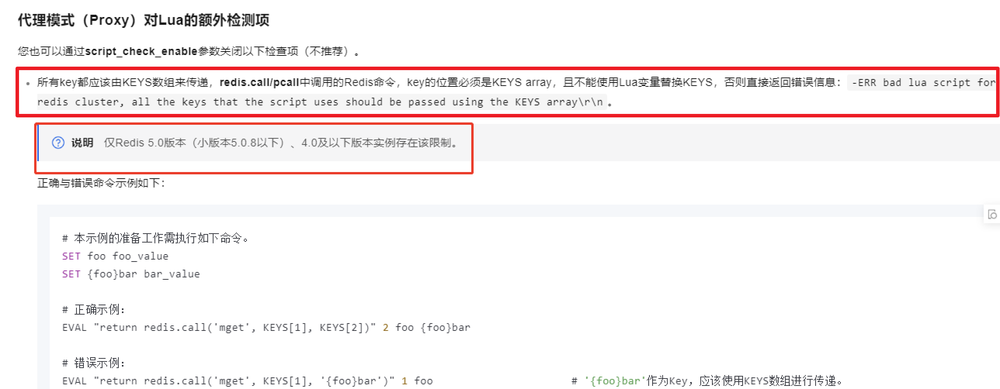
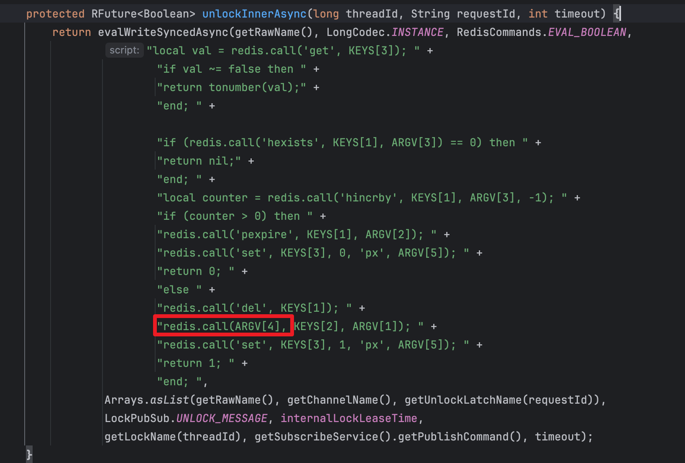
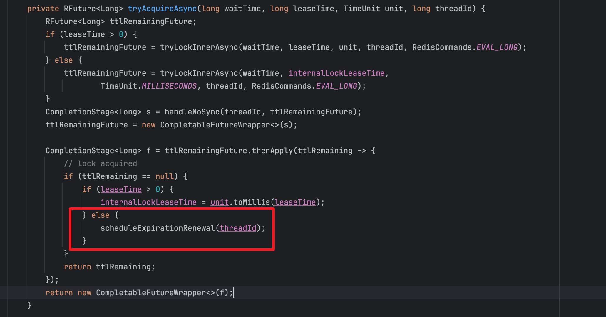
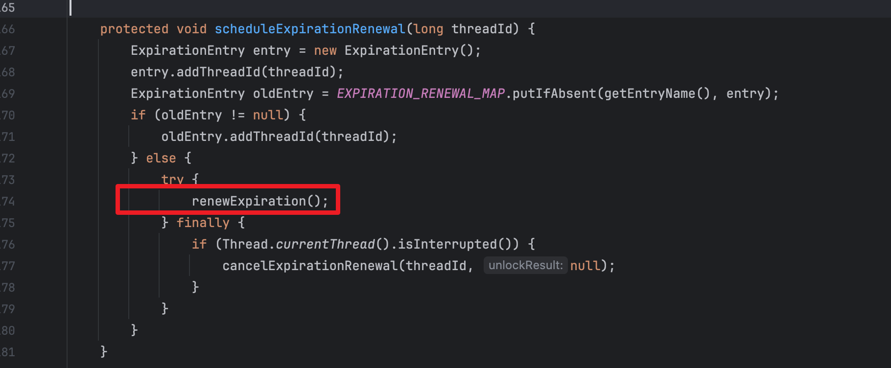
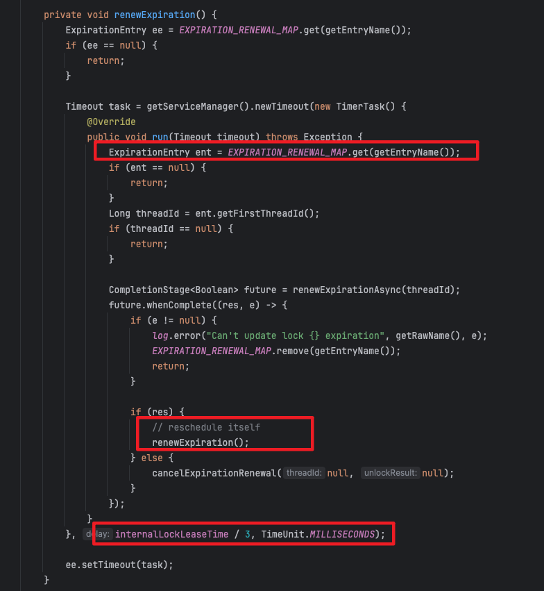
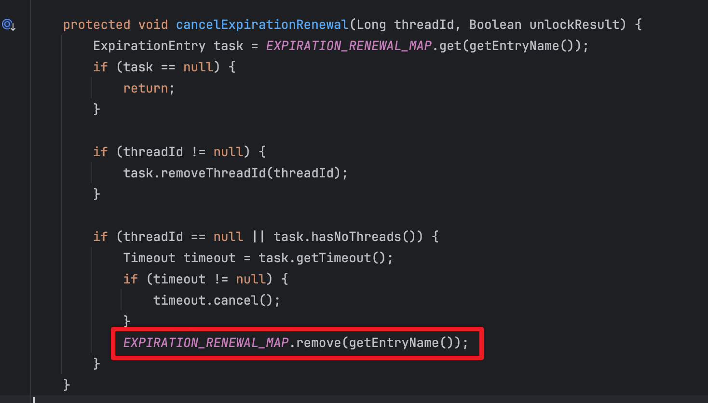
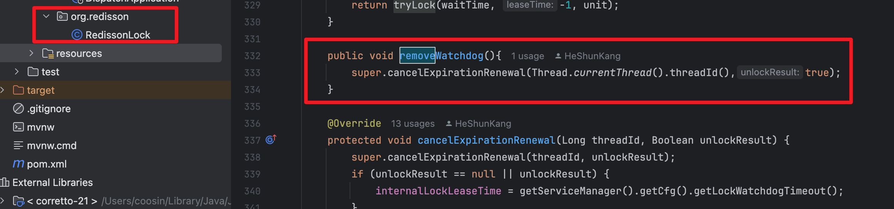
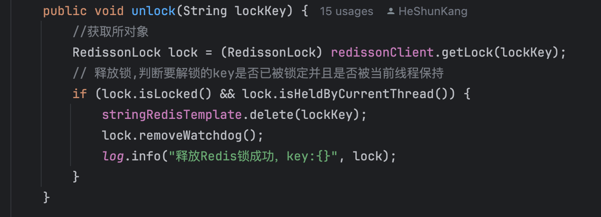

### Redison在阿里云redis集群下删锁失败优化

#### 背景：

- 用的阿里云的redis
- 在新项目中使用redission用作分布式锁进行unlock的时候测试环境发现报错：

```java
errorMessage:ERR bad lua script for redis cluster, first parameter of redis.call/redis.pcall must be a single literal string.
```

#### 问题原因：

1. 先去redission的issue里找有没有相同的问题：确实找到了，发现这是阿里云redis集群的一个限制

   

2. 在阿里云的文档看到了相关的限制说明



3. 然后去看redission unlock的源码找到相关的lua脚本，猜测可能是因为这里的命令ARGV传入导致触发了阿里云的该限制



4. 但是由于这个锁的释放时间不好预估，因为有些的任务的执行时间十分不确定,所以还是需要看门狗去进行续期，于是去看redission的源码看门狗是如何实现的：

   -  这里的`scheduleExpirationRenewal`是执行看门狗的关键方法这，可以看到当`lessTime<=0`的时候才会触发看门狗，lessTime对应的是过期时间

   

   - 继续往下看，进入到`renewExpiration`

   

   - 这里`EXPIRATION_RENEWAL_MAP`的作用其实就是跟踪哪些锁需要进行自动续期，以及哪些线程正在持有锁，key就是锁的名称，value就是一个包含了特定相关线程信息的对象
   - `renewExpirationAsync`就是续期的lua脚本
   - 续期的时间就是`到期时间的1/3`

   

- 通过看`看门狗`的底层实现发现，看门狗的核心是`EXPIRATION_RENEWAL_MAP`中所维护的信息,同时看到当`加锁时线程中断`亦或`unlock`的时候都调用了`cancelExpirationRenewal`这个方法去remove掉该线程里的`EXPIRATION_RENEWAL_MAP`的信息，这就是我们想要的方法



- 因此我们想手动调用一下`cancelExpirationRenewal`方法，但由于它是protected类，因此这里直接将该类copy出来，加上一个public的方法去进行调用，类加载时候会先加载我们编写的类再加载外部的依赖



- 最后判断锁的持有，再进行锁的delete和去掉看门狗



- 最后就能正常delete了～，这里我们的任务没有用到重入的锁的场景，因此这里就直接调用redis的delete方法了
