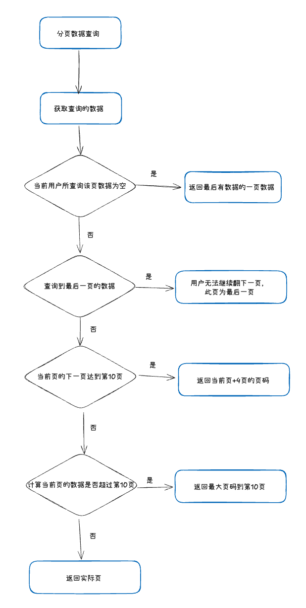
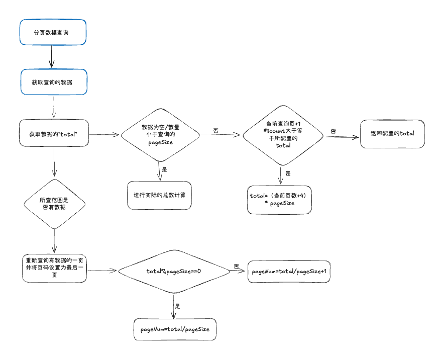

### 亿级数据报表实时查询分页方案设计

#### 背景：

- 在禁配解禁业务中，业务需要**实时**根据不同的维度去查看商品的禁配解禁、单据的禁配解禁情况等情况

#### 挑战：

- 在禁配解禁业务下，禁配解禁的数据都是业务数据，无法归档，在门店/商品的增长下，数据越来也多，分别需要基于三张大表去做查询，分别是`result`表（11亿），`reason`表（11亿），`log表`(5亿)，在这种表体量下，用了阿里云的ADB 去进行支撑查询，而在这种大体量有些报表数据需要连表的情况下，count的代价会十分之大

#### 解决思路

- 学习google、biying、百度等大数据搜索引擎的解决方案，可以看到这里没有展示具体的total，只会展示前10页

  

- 而如果搜索条件匹配到的内容少于10页，则会展示具体**页数**

- 如果内容大于10当前页数，则会默认在当前页数+4页

  

#### 实现方案：

 业务逻辑：




- 技术实现方案




##### 代码实现：

###### 1. **泛型类定义和类型参数**

```java
public class RainbowPageCountTemplate<R, T extends PageBaseDto> {
 }
```

- 先定义一个公共模板类 `RainbowPageCountTemplate`，这是一个模板类
- 这里使用了泛型，使得这个类更加通用。
  - `R`:  代表查询结果列表中单条数据的类型 (Result Type)。例如，如果查询的是用户列表，`R` 可能就是 `User` 类。
  - `T extends PageBaseDto`: 代表查询条件对象的类型 (Template Parameter Type)，并且限定了 `T` 必须是 `PageBaseDto` 或其子类。`PageBaseDto` 是项目中定义的一个基础分页DTO，包含了分页相关的参数，如 `pageSize`（分页大小）和 `pageNum`（当前页码）。

###### 2.**函数式接口定义**

```java
@FunctionalInterface
public interface DataCountFunction<T> {
    int apply(T object, int queryCount);
}

@FunctionalInterface
public interface DataQueryFunction<R, T> {
    List<R> apply(T object);
}
```

- `@FunctionalInterface`:  注解表示这是一个函数式接口，这种接口可以方便地使用 Lambda 表达式或方法引用来实现。

- 这里定义了两个函数式接口：

  - `DataCountFunction<T>`：用于**获取数据总数**，
    - 接受两个参数：
      - `T object`:  查询条件对象。
      - `int queryCount`:  当前查询的记录数量（只查指定数量的count，防止count所有数据）
    - 返回值 `int`:  返回数据总数。

  ```java
  public interface DataCountFunction<T> {
      int apply(T object, int queryCount);
  }
  ```

  - `DataQueryFunction<R, T>`: 用于**执行数据查询**。
    - `T object`:  查询条件对象。
    - 返回值 `List<R>`:  返回查询到的数据列表

  ```java
  public interface DataQueryFunction<R, T> {
      List<R> apply(T object);
  }
  ```

  

###### 3.**构造函数**

```java
public RainbowPageCountTemplate(DataCountFunction<T> dataCountFunction, DataQueryFunction<R, T> dataQueryFunction, int pageCount) {
    this.dataCountFunction = dataCountFunction;
    this.dataQueryFunction = dataQueryFunction;
    this.pageCount = pageCount;
}
```

- 参数：
  - `DataCountFunction<T> dataCountFunction`:  需要传入 `DataCountFunction` 的实现，用于执行数据总数计算。
  - `DataQueryFunction<R, T> dataQueryFunction`:  需要传入 `DataQueryFunction` 的实现，用于执行数据查询。
  - `int pageCount`: 需要传入所配置的 `pageCount` 的值，用于总页数估算

###### 4. 核心计算逻辑

```java
    /**
     * 获取分页数据
     *
     * @param pageSize 分页大小
     * @param pageNum 当前页
     * @param object 查询条件
     * @return 分页数据
     */
public Pager<R> getDataByPage(int pageSize, int pageNum, T object) {
    //获取查询数据
    List<R> data = getData(object);
    //获取total
    int total = countPage(pageSize, pageNum, object, data.size());
    Pager<R> pager = new Pager<>(pageNum, pageSize);
    //如果查询的结果为空，重新查询有数据的一页
    if (CollectionUtils.isEmpty(data)) {
        int currentPageNum = total / object.getPageSize();
        if (total % object.getPageSize() != 0) {
            currentPageNum++; // 如果有余数，结果加 1
        }
        object.setPageNum(currentPageNum);
        //重新查询最后一页的数据
        data = getData(object);
        pager.setPageNum(currentPageNum);
    }
    pager.setResultList(data);
    pager.setTotal(total);
    pager.setPageCount(data.size());
    return pager;
}
```

- 方法逻辑：

  1. 获取数据
     - `List<R> data = getData(object);`: 调用 `getData` 方法，根据查询条件 `object` 获取当前页的数据列表。
  2. 获取total
     - `int total = countPage(pageSize, pageNum, object, data.size());`: 调用 `countPage` 方法，计算总页数，并将已获取的数据列表大小 `data.size()` 传入，以便 `countPage` 方法根据数据大小进行不同的总数计算策略。

  3. 设置正确的数据与页面

  - 处理空数据情况
    - 如果数据为空，说明当前请求的页码可能超出了实际数据范围，此时需要重新查询**最后一页有数据**的页码。
    - `int currentPageNum = total / object.getPageSize();`:  计算最后一页的页码：总数 `total` 除以每页大小 `object.getPageSize()`。
    - `if (total % object.getPageSize() != 0) { currentPageNum++; }`:  如果有余数，说明最后一页还有数据，因此页码需要加 1。
    - `object.setPageNum(currentPageNum);`:  更新查询条件对象 `object` 的页码为计算出的最后一页页码。
    - `data = getData(object);`:  **重新调用 `getData` 方法**，使用更新后的页码 `object` 重新查询最后一页的数据。
    - `pager.setPageNum(currentPageNum);`:  更新 `pager` 对象的页码为最后一页页码。

- countPage方法：

```java
    /**
     * 计算总页数
     *
     * @param pageSize 分页大小
     * @param pageNum 当前页
     * @param object 查询条件
     * @param dataSize 数据总数
     * @return 总页数
     */
public int countPage(int pageSize, int pageNum, T object, int dataSize) {
    int total;
    int queryCount = pageNum * pageSize;
    // 如果获取的列表为空或者数量小于 `pageSize`，就进行总数计算
    if (dataSize == 0 || dataSize < pageSize) {
        total = getDataCount(object, queryCount);
        //如果当前页+1页的Count即将超过总页数，返回后四页的总数
    } else if ((queryCount + pageSize) >= pageCount) {
        // 如果查询结果不为空且足够满足分页大小，使用估算的总数
        total = (pageNum + 4) * pageSize;
    } else {
        //否则则返回limit配置数量的总数，比如配置了200条，则limit 200去进行count
        total = getDataCount(object, pageCount);
    }
    return total;
}
```

- 方法逻辑：

  1. 如果数据是否已到末尾或者数据总量较少，则需要**精确计算总数**。
  2. 否则如果即将超出预设的页数限制（这里是当前页加下一页的数据量），为了避免频繁的精确计数，这里进行**估算总页数**
  3. 如果以上两个条件都不满足，说明当前页数还未达到预设的**total**，因此进行去尝试计算是总数是否超过total（这里是为了保证数据少于预设total的时候，能够正常展示准确的total，但数据量太大的时候又不会count所有数据）

  

**`getDataCount` 方法**

- 用于**获取数据总数**。

```java
public int  getDataCount(T object, int queryCount) {
    return dataCountFunction.apply(object, queryCount);
}
```

**`getData` 方法**

- 用于**获取数据列表**。

```java
public List<R> getData(T object) {
    return dataQueryFunction.apply(object);
}
```

###### 5. 工厂类统一生成模版类

```java
@Component
public class RainbowPageCountPageCountFactory {

    @Value("${config.count:200}")
    private Integer configCount;

    /**
     * 创建彩虹分页模版类
     * @param dataCountFunction 计算总数的方法
     * @param dataQueryFunction 查询数据的方法
     * @return
     * @param <R> 返回数据类型
     * @param <T> 查询参数类型
     */
    public <R,T extends PageBaseDto> RainbowPageCountTemplate<R,T > createReportRainbowPageCount(RainbowPageCountTemplate.DataCountFunction<T> dataCountFunction, RainbowPageCountTemplate.DataQueryFunction<R,T> dataQueryFunction) {
        return new RainbowPageCountTemplate<>(dataCountFunction,dataQueryFunction, reportPageCount);
    }
}
```


具体使用方法：

```java
        //创建彩虹分页计算类：传入计算总数的方法和查询数据的方法
        RainbowPageCountTemplate<ReportOrderVo, ReportOrderDbQueryDto> reportRainbowPageCount =
                rainbowPageCountPageCountFactory.createReportRainbowPageCount(
                        reportMapper::countReportOrder, reportMapper::listReportOrder);
				//获取分页结果
        Pager<ReportOrderVo> page = reportRainbowPageCount.getDataByPage(dto.getPageSize(), dto.getPageNum(), reportOrderDbQueryDto);
```


