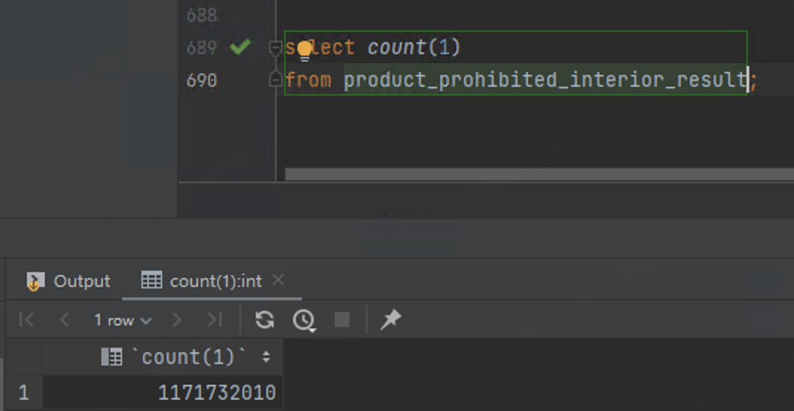

## 亿级数据查询Excel流式导出

#### 背景：

- 业务部门需要从实时报表中导出详细数据，用于进一步分析和处理。该报表的数据有两张数据量均超过 10 亿级别的核心业务表。 为了满足报表的数据关联需求，需要进行多表关联查询。

#### 挑战：

1. **数据量巨大，内存溢出风险 (OOM)：**  报表数据量庞大，若一次性将所有数据加载到内存中进行处理和导出，极易导致应用程序内存溢出 (OOM)。
1. **同步导出：**  由于该报表功能直接嵌入在其他团队的系统中，对方系统暂无异步下载中心的开发排期，因此数据导出必须以同步方式进行，对导出性能和响应时间提出了极高要求。


#### 实现方案：

1. **选择 CSV 文件格式：**  由于导出的数据简单，因此导出文件格式选择 CSV，而非 Excel 等二进制格式。 CSV 格式具有以下优势，更适用于海量数据导出：
   - **生成速度快：**  CSV 文件结构简单，生成速度远快于 Excel 等复杂格式。
   - **资源消耗低：**  CSV 文件生成过程对内存和 CPU 资源消耗更小，更适合内存敏感型的大数据导出场景。。
2. **采用 Cursor 游标流式查询：**  针对海量数据查询，核心优化在于避免一次性加载全部数据。我们采用数据库 Cursor 游标技术，实现数据流式读取：
   - **服务端游标，按需获取：**  开启 MyBatis 的 Cursor 游标功能，每次仅按需从数据库流式读取少量数据，而非一次性加载所有数据到内存。
   - **分批处理，逐行写入：**  将游标返回的数据分批次 (每次读取 size 行，size 大小可配置) 处理，处理完成后立即写入 CSV 文件输出流，并清空内存中的数据缓存，有效控制内存占用，避免 OOM 风险。
   - **规避深分页，提升性能：**  游标流式查询本身避免了传统 `OFFSET` 深分页模式的性能瓶颈，能够保证亿级数据量下，数据查询和导出的高效性。
3. 限制导出数据总量：  为保障系统稳定性和导出任务的可控性，增加了导出数据总量的限制机制，

- **可配置上限：**  通过 Apollo 配置中心，设置允许导出的最大数据行数 (例如 50 万行)。

```java
 public void export(HttpServletResponse response, Object queryParam) {
        String fileName = getFileName();
        // 设置响应头，表明返回的是一个 CSV 文件
        response.setContentType("text/csv");
        response.setCharacterEncoding("UTF-8");
        response.setHeader(HttpHeaders.CONTENT_DISPOSITION, "attachment;filename=" + fileName + ".csv");
        // 获取输出流，逐行写入数据
        try (OutputStream outputStream = response.getOutputStream();
             BufferedWriter writer = new BufferedWriter(new OutputStreamWriter(outputStream, StandardCharsets.UTF_8))) {
            // 写入 CSV 文件的头部
            String header = getHeader();
            writer.write(header);
            log.info("Start to write CSV file {}", fileName);
            try (SqlSession sqlSession = dataHubSqlSessionFactory.openSession();
                 Cursor<T> dataCursor = getData(sqlSession, queryParam)) {

                List<T> temp = new ArrayList<>();
                for (T data : dataCursor) {
                    temp.add(data);
                    // 达到配置行数后进行写入
                    if (temp.size() > size) {
                        String dataStr = formatData(temp);
                        writer.write(dataStr);
                        temp.clear();
                    }
                }
                // 写入剩余数据
                if (!temp.isEmpty()) {
                    String dataStr = formatData(temp);
                    writer.write(dataStr);
                }


            }
            writer.flush();
            log.info("CSV file {} has been written successfully", fileName);
        } catch (IOException e) {
            log.error("Error while writing CSV file", e);
            // 处理 IO 异常
            throw new RuntimeException("Error while writing CSV file", e);
        }
    }
```

- 开启游标查询

```java
@Select("xxx")   
@Options(fetchSize = Integer.MIN_VALUE)
    Cursor<ReportProductVo> exportReportProduct(@Param("dto") ReportProductDbQueryDto dto);
```

- 限制导出条数

```java
    @Value("${report.export.size:500000}")
    private Integer exportSize;

@Override
    protected Cursor<ReportProductVo> getData(SqlSession sqlSession, Object queryParam) {
        if (!(queryParam instanceof ReportProductDbQueryDto param)) {
            throw new BusinessException("参数类型错误");
        }
        // 计算查询的总数
        param.setPageSize(exportSize);
        param.setPageNum(1);
        return sqlSession.getMapper(ReportMapper.class).exportReportProduct(param);
    }
```

