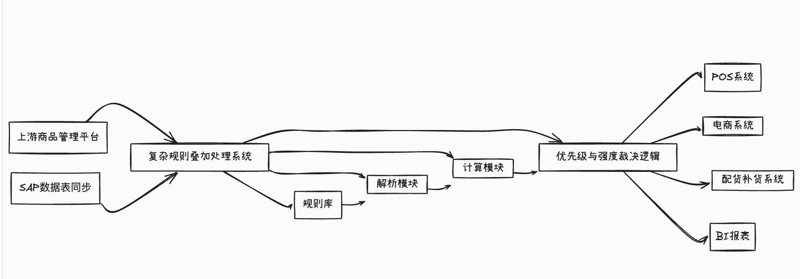
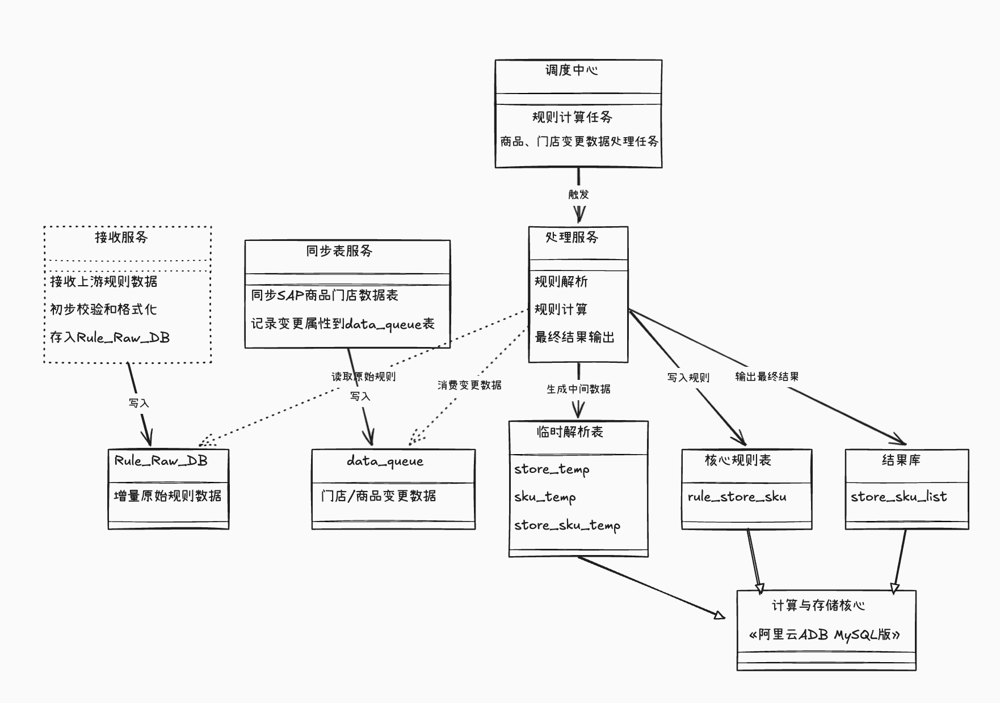
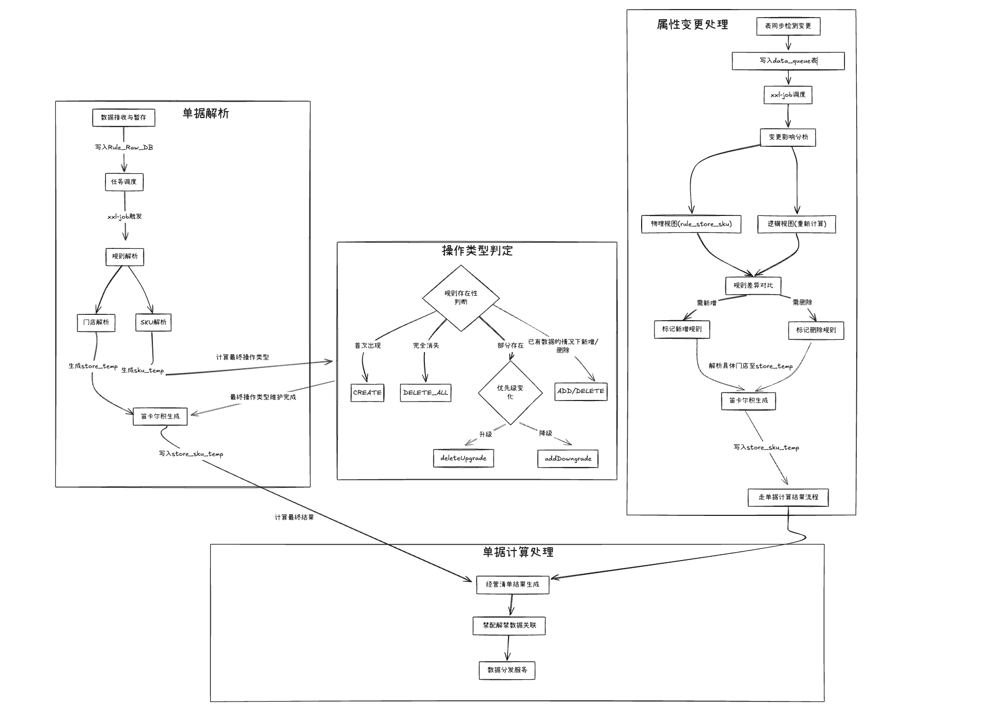

### 从零到亿级：商品准入规则系统架构设计之路

#### 一、业务背景和核心业务术语解析：

- **商品禁配/解禁 ：** 即某些商品因特定原因（如区域限制、法律法规）不允许在某些门店销售（构成一个基础的“黑名单”）。“解禁”则是对这些禁配规则的特殊调整或豁免。

- **正向管控：** 与“禁配”的黑名单思维相对，“正向管控”更像是一种“白名单”机制。它精确定义在满足哪些规则条件组合下，商品才允许在特定门店销售。此次的核心正是围绕这种更为主动和精细的管控模式。

- 规则维度拆解：

   规则的定义依赖于多重维度：

  - 商品维度：
    - **SKU:** 最小商品管理单元，精确到每一个具体的商品品项。
    - **细类：** 商品的分类，如“乳制品-酸奶”、“服装-男士衬衫”等。
  - **门店维度 ：** 具体门店、省、市、门店等级、门店店态（普通店，大店，仓店）等

- 规则优先级与强度：

  - **优先级 ：** 不同规则具有不同的优先级数值。当多个规则同时作用于同一“门店-SKU”时，优先级最高的规则生效。
  - **强度 ：** 规则本身还带有一个“强度”值，用以判断是否能“突破”某些基础的禁配原因。例如，一个高强度的促销规则可以临时允许销售一个因常规区域限制而被禁配的商品。

**2. 业务需求全景：**

核心业务目标是构建一个能够动态、准确、高效管理“在哪些门店，可以经营哪些SKU”的经营清单模块。该系统需要能够处理来自业务方配置的各类规则，经过计算后，输出最终的“门店-SKU”可经营列表。



#### 二、 直面技术挑战

1. **规则计算的极致复杂性：** 一个SKU可能同时被“细类禁售全国”、“某省可售”、“某市A类门店因活动可售（高优先级）”等多条规则命中。如何准确应用优先级和强度进行计算，是核心难题。
2. **状态管理的动态与连锁反应：** 规则的新增、修改、删除（比如高优先级规则的删除，需要低优先级规则自动“浮现”并生效），以及商品、门店自身属性的变更（如门店升级、商品归类调整），都会引发一系列连锁的状态更新。
3. **数据体量的“洪峰”：** 约18万活跃SKU，近1.4万家门店，规则的交叉组合后的潜在数据量级轻易达到 **亿级别**，同时，已有的“商品禁配解禁”历史数据已达13亿，该模块需要能有效整合或处理。
4. **动态变更的及时响应：** 业务侧对于规则变更后的生效时效性有要求

#### 三、 运筹帷幄：整体架构设计

为了应对挑战并达成目标，设计了如下的系统架构



**1. 系统架构设计：**

我们的系统采用服务化、批处理为核心的架构。

- **接收服务 ：** 轻量级服务，负责接收来自上游（如规则管理平台规则数据），进行初步校验和格式化后，存入**原始规则表 (Rule_Raw_DB)**。
- 同步表服务：同步商品表、门店表数据的同时针对门店/商品属性变更数据推入**变更队列表 (data_queue)**
- **调度中心 (xxl-job)：** 核心的批处理任务调度引擎。定时触发规则计算与变更数据处理任务。
- **处理服务：** 核心的规则处理应用，负责执行具体的规则解析、计算、状态管理等复杂逻辑。
- **计算与存储核心 (阿里云ADB MySQL版)**：
  - **临时解析表：** 存放由处理服务解析原始规则后生成的中间数据（如`store_temp`, `sku_temp`,`store_sku_temp`）。
  - **核心规则表：** 存放门店-sku不同优先级的规则数据（`rule_store_sku`）。
  - **结果库：** 存放最终生效的门店-SKU可经营列表（如`store_sku_list`）。
  - 变更队列表:存放变更的商品/门店数据(data_queue表)


#### 四、 精雕细琢：核心实现方案与难点攻坚

- 以下是整体单据处理和商品门店属性变更处理流程



- 普通单据(只记录了关键步骤)

  - **单据解析**：

    1.  **数据接收与暂存**： 接收服务将上游原始规则和变更信息写入`Rule_Raw_DB`，并为每批变更生成一个唯一的“批次ID”。

    2. **任务调度：** xxl-job触发调度服务去进行计算处理

    3. **规则解析**：核心是将`rule_raw`表中的规则（如“广东省所有A级旗舰店可售某细类商品”）解析为为具体的`(store_id, sku_id, rule_id)`三元组列表。

       - **门店解析：** 根据原始规则中定义的门店维度条件（如省份、城市、门店等级等），查询门店主数据表，筛选出符合条件的门店ID列表，与`rule_id`关联后存入`store_temp`。
       - **SKU解析：** 若规则为SKU，则直接使用该SKU列表；若为细类，则查询商品主数据表，获取该细类下的所有SKU列表，与`rule_id`关联后存入`sku_temp`。
       - **笛卡尔积生成基础关联：** 将`store_temp`和`sku_temp`中相同`batchId`的记录进行关联（笛卡尔积），生成初步的`(store_id, sku_id, rule_id)`集合，并带上规则的优先级、强度等信息，写入到`store_sku_temp`表中作为最终要处理的商品门店数据

    4. **计算规则数据真正的操作类型**

       - **新增（ADD）：**若一个`(sku_id)`在之前已经存在，则为新增
       - **删除(delete)**若一个`sku_id`在删除后还有数据，则为普通的删除

       - **初始化 (CREATE)：** 若一个`(sku_id)`在本批次首次出现规则关联，且之前在`store_sku_list`中不存在，则状态为CREATE。

       - **删除全部 (DELETE_ALL)：** 若一个之前在`store_sku_list`中存在的`(store_id, sku_id)`，在本批次计算后，在`rule_store_sku`中已无任何有效规则关联它（即所有相关规则都被删除或失效），则状态为DELETE_ALL。

       - **降级 (addDowngrade)**：若一个( sku_id)之前生效的是高优先级规则RA，但RA在本批次被删除或修改导致其不再适用于该组合。此时，在rule_store_sku中为该组合查找当前仍然有效的、优先级次高的规则RB，并使其生效。这些数据即为addDowngrade。

       - **升级 (deleteUpgrade)：** 若一个`(sku_id)`之前生效的是规则RA (优先级PA)，本批次计算后应生效的是规则RB (优先级PB)，且PB高于PA，则状态为deleteUpgrade。原RA在该组合上失效（

         - 实现伪代码思路 (升级处理)：

           在sku_temp表中维护deleteUpgrade的sku

           ```sql
                   insert into manage_rule_sku_temp_all(sku_id, operate_type,final_operate_type, origin_business_id, rule_id, batch_id,rule_priority)
                       select a.sku_id,'deleteUpgrade','deleteUpgrade',l.origin_business_id,a.rule_id,#{batchId},l.rule_priority
                       from manage_rule_sku_temp_all a
                        INNER JOIN manage_store_sku_list l ON a.sku_id = l.sku_id and delete_flag =0
                       where final_operate_type = 'add' and batch_id=#{batchId}
                       and a.rule_priority > l.rule_priority;
           ```

              找到历史生效规则与此次规则不重合的门店数据维护到store_sku_temp表中

           ```sql
                       INSERT INTO manage_rule_temp_all (origin_business_id, operate_type, sku_id, store_id, brand_organization, strength, rule_id, rule_priority, batch_id,index_key)
                       select sl.origin_business_id,'deleteUpgrade',sl.sku_id,sl.store_id,sl.brand_organization,sl.strength,sta.rule_id,sl.rule_priority,#{batchId},sl.index_key
                       from manage_rule_sku_temp_all sta inner join
                           manage_store_sku_list sl on sta.sku_id=sl.sku_id and sta.batch_id=#{batchId} and sta.final_operate_type='deleteUpgrade'
                       left join manage_rule_temp_all a on a.index_key=sl.index_key and a.batch_id=#{batchId} and a.operate_type='add'
                       where delete_flag=0 and a.sku_id is null
           ```

  - **单据计算处理**

    1. **经营清单结果生成**：
       - 将`sku_store_temp`表中的数据根据不同的操作类型，计算进入到`rule_store_sku`和`sku_store_temp`表中
    2. **禁配解禁数据关联：** 再根据原禁配解禁数据的原因是否为长期原因去计算最终的可经营结构写入到禁配解禁结果表中
    3. **数据分发/服务：** 通过禁配解禁的下发服务下发到各个下游系统


- **商品、门店属性变更**

1. 通过表同步时对比变化的字段，并写入到队列表中等待处理
   - 以下是队列表结构，该表承载着新增和更新的数据，在data_key中以json结构存储着数据的主键，change_column也以json结构存储着变化的数据，不同的业务模块可以获取他们想要的数据去进行处理

```sql
create table data_queue
(
    id              bigint auto_increment comment '主键id'
        primary key,
    data_table_name varchar(16) charset utf8 default ''                        not null comment '数据所属表名',
    data_type       varchar(16) charset utf8 default ''                        not null comment '数据变动类型',
    data_key        json charset utf8 not null comment '数据主键',
    message_status  int                      default 1                         null comment '消息处理状态 1-待处理 2-处理中 3-处理成功 4-处理失败 5-忽略处理',
    created_time    timestamp                default '2024-08-01 22:52:30.433' not null comment '创建时间',
    change_column   json charset utf8 null comment '更改的字段'
)
    engine = InnoDB
    collate = utf8_bin; 
```

 例如门店变更查找变更的数据sql如下：查找门店表中更新了特定字段的数据

```sql
        select replace(json_extract(d.data_key, '$.store_id'), '"', '') as store_id,d.id
            from data_transaction_queue d
              where d.data_type = 'UPDATE'
              and d.data_table_name = 'store'
              and json_contains_path(d.change_column, 'one', '$.place_brand_organization_attribute', '$.store_operation',
                                     '$.store_type', '$.store_nature', '$.country_region_code',
                                     '$.region', '$.city') = 1
              and message_status = 1
```


2. 任务调度与消费：通过xxl-job去进行任务的调度
3. 变更影响分析（“物理视图”与“逻辑视图”对比):
   - **获取物理视图**：查询`rule_store_sku`，获取该门店当前所有生效规则。这是变更前该门店的“实际”规则应用情况。
   - **构建逻辑视图**：基于门店变更后的新属性，重新与所有原始规则（`Rule_Raw_DB`）进行匹配，计算出理论上在新属性下应该命中的所有规则。这是变更后该门店“应有”的规则应用情况。
4. **规则差异对比**：
   - 物理视图有，逻辑视图没有的规则：标记为需要删除的规则
   - 逻辑视图有，物理视图没有的：标记为需要新增的规则
5. 生成具体变更数据
   - 将需要新增/删除的门店规则解析到具体门店维护到store_temp表中
   - 根据该规则id到`rule_store_sku`表中拿到该规则命中的sku，与`store_temp`做笛卡尔积维护到`store_sku_temp`中，这里就是最终需要插入的数据
6. 走普通单据的单据计算结果流程


#### 五、 “从0到1”的心路历程与关键决策点

1. 性能优化实践的“秘籍”：

- 合理设计Distribution Key和Partitioning Key，避免数据倾斜。
- **临时表策略：** 使用临时表承载中间计算结果，减少数据直接打入内存导致应用OOM。确保临时表在批处理结束后及时清理。
- **增量计算：** 对比商品门店属性变更生效数据时，先获取差异具体规则，再直接根据规则id去表中获取/解析到具体数据到临时表中，保证内存中只有少量的单据，而没有具体的单据中的sku门店数据，减少内存占用，避免OOM

2. 业务拆解复杂业务需求

- **“升级”、“降级”逻辑的噩梦：** 项目初期，低估了规则优先级动态调整（特别是高优规则删除后，次优规则如何“浮现”生效）的复杂性。不能仅依赖上游给的ADD/DELETE标记，必须在系统内部建立一套基于“当前全量规则优先级快照”的最终状态判断机制。我们引入了`initial_operate_type`和`final_operate_type`来区分原始意图和系统计算的最终动作。通过在`sku_temp`表中细致对比本批次数据与`rule_store_sku`历史数据、`store_sku_list`当前生效数据，才真正理清了“升级”和“降级”等最终状态的精确数据范围和处理逻辑。SQL层面则大量使用临时表分解复杂逻辑，并通过sql分析调优最终达到预期
- **统一流程处理的追求**：无论是“普通单据”的批量规则计算，还是新品、新店的引入，亦或是门店、商品属性变更触发的增量更新，实现了将最终数据处理逻辑导向一套统一的“单据计算结果流程”。这意味着，一旦`store_sku_temp`准备就绪，后续更新`rule_store_sku`和`store_sku_list`的步骤是高度复用的。

**3. 个人收获：** 这段从0到1的经历，不仅锤炼了我在海量数据处理、复杂系统架构设计、SQL深度优化等方面的技术硬实力，更重要的是提升了自己在拆解复杂需求的能力。


