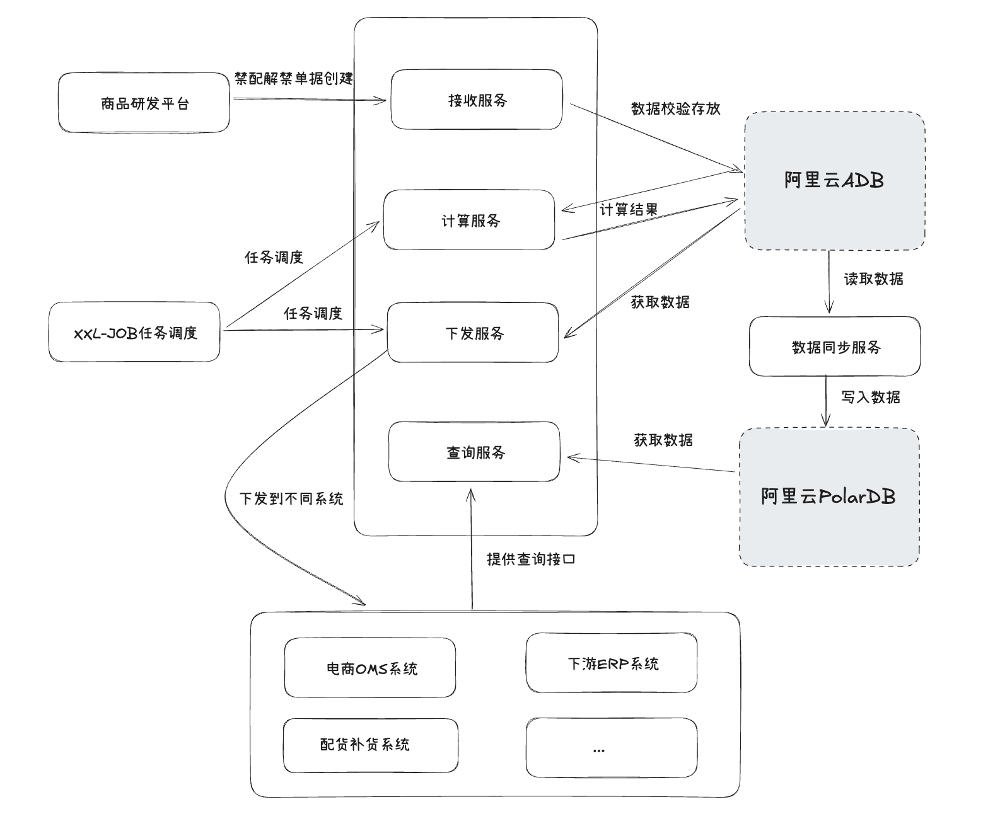

### 禁配解禁亿级数据计算处理

**摘要：** 随着业务的快速发展，历史遗留的复杂禁配规则导致系统性能瓶颈日益突出，影响了11亿级商品禁配数据的解禁效率和业务的敏捷性。这里将介绍我们如何以阿里云AnalyticDB (ADB)为核心，通过数据分片与分区优化、服务化架构以及一系列配套策略，有效解决了大规模数据计算处理的难题，实现了禁配解禁结果的准实时计算查询，为业务运营提供了有力的技术保障。


### 一、背景：海量数据与复杂规则下的业务困境与技术挑战

- 在零售与电商领域，“禁配解禁”是精细化运营的关键环节，它直接控制商品在特定区域、门店或渠道的销售、配货及采购资格。然而，在系统优化前，我们面临着严峻的挑战：
  - **业务痛点显著**：例如，在重要的全国性促销活动前夕，由于禁配解禁任务处理效率低下，大量核心商品无法按时在指定门店上架，直接导致了潜在销售额的重大损失，并对品牌声誉及用户体验造成了负面影响。此类情况一度成为困扰业务的常态。
  - **禁配逻辑高度复杂**：系统的禁配规则不仅覆盖“仓库”层级的禁采、禁售、禁配，还延伸至“门店”层级的禁售、禁配。此外，还有版权限制、特定包装材料的环保规定等多种逻辑交织。
  - **数据规模大**
    - **禁配解禁结果表 (result)**：存储最终禁配状态，记录量高达11亿。
    - **禁配解禁原因表 (reason)**：记录每条禁配的具体原因，记录量同样达到11亿。
    - 这些数据均为业务数据，无法进行归档操作
  - **下游系统多且实时型要求高**：计算生成的禁配解禁结果需迅速同步至多达5个下游系统，以支持其后续业务流程。业务对禁配状态的生效时间有着“准实时”（分钟级）高要求。
  - **原系统设计瓶颈**：早期系统设计未能充分预估数据量的爆炸式增长和业务逻辑的快速复杂化，导致计算任务执行缓慢，无法按时完成禁配解禁，对业务敏捷性造成了较大制约。


### 二、精雕细琢：基于ADB的亿级数据处理架构与实现

- 当数据量级达到10亿以上，传统的单机关系型数据库（如MySQL）在复杂计算和分析上早已捉襟见肘，完全依赖应用层内存计算更是极易导致OOM，该系统需要批量计算能力、对复杂SQL的良好支持以及可接受的运维成本，同时兼顾一定的查询分析能力。

- 因此，选择**阿里云ADB (MySQL版)** 作为本次禁配解禁计算的核心引擎。同时，对于需要高并发、低延迟的**禁配状态查询**场景（例如，我们引入了**阿里云PolarDB (MySQL版)** 作为查询服务的数据源。我们会将ADB计算完成的最新禁配结果准实时同步到PolarDB，由PolarDB对外提供高QPS的查询服务。

#### 3.1 整体架构




#### 3.2 ADB核心表结构设计 (分片与分区)

面对两张11亿级别的主表 (`result` 和 `reason`)，合理的分片键 (Distribution Key) 和分区键 (Partitioning Key) 设计是提高ADB查询性能、避免数据倾斜的重中之重。

##### 3.2.1 分片键选择

分片键决定了数据行如何在ADB集群的各个计算存储节点上物理分布。

**`result` 表的分片键选择**：对于  `result` (禁配结果) 表的**分片键为 `store_id, sku_id`**。

- **选择依据**：`store_id` (门店ID) 和 `sku_id` (商品SKU的ID) 是禁配结果查询和核心业务逻辑中最核心、关联最频繁的两个维度。以这两者作为联合分片键，可以确保同一门店同一商品相关的最终禁配状态信息。确保根据这两个纬度搜索的数据处于同一分片中。

**`reason` 表的分片键选择**： 对于 `reason` (禁配原因) 表，其**分片键被设定为 `order_id, store_id, sku_id, reason_code, forbid_type`**。

- **选择依据**： 面对高达11亿条的 `reason` 记录，确保数据在各个物理分片间的均匀分布，是设计分片策略时的核心目标之一，旨在最大限度地发挥数仓的并行处理优势并避免数据倾斜。因此采用这五个字段的完整组合作为分片键：**该组合是业务数据层面最细粒度的唯一标识，最大程度地将每一条独立的记录实例散列到不同的存储位置，从根本上促进数据在物理节点上的均匀分布**

##### 3.2.2 分区键选择

分片数量为64，一个表有10E数据，每个分片有1500w数据，每个分片数据太大会导致查询性能下降，每个分区都会有独立的索引，因此进行分区加快查询速度

- **分区策略**：考虑到业务查询常以门店 (`store_id`) 为主要筛选维度，且门店数量适中（约7000家），决定围绕门店设计分区。为了避免分区过多（直接用`store_id`做分区可能导致7000个分区，每个区仅有1400条数据，分区粒度过细）且保证每个分区有合理的数据量（期望百万级），引入了一个间接分区管理机制去实现每1000家门店为一个分区。

- **`store_index_config` 表**：用于存储门店ID到分区ID (`id_key`) 的映射关系。

  ```
  CREATE TABLE store_index_config (
      id BIGINT AUTO_INCREMENT COMMENT '自增主键',
      store_id VARCHAR(64) NOT NULL COMMENT '门店ID (实际长度根据业务调整)',
      id_key INT NOT NULL COMMENT '分区ID (用于主表分区)',
      create_time TIMESTAMP DEFAULT CURRENT_TIMESTAMP COMMENT '创建时间',
      update_time TIMESTAMP DEFAULT CURRENT_TIMESTAMP ON UPDATE CURRENT_TIMESTAMP COMMENT '更新时间',
      PRIMARY KEY (id),
      UNIQUE KEY uk_store_id (store_id), -- 确保门店ID唯一
      KEY idx_id_key (id_key)         -- 便于按分区ID反查或管理
  ) ENGINE=InnoDB CHARSET=utf8mb4 COLLATE=utf8mb4_unicode_ci COMMENT='门店与分区ID映射配置表';
  ```

- **`id_key` (分区ID) 生成与维护**：

  1. **初始化**：一次性将所有存量门店ID读出，进行分组，每1000个门店赋予一个从1开始递增的`id_key`，并将映射关系写入`store_index_config`。

  2. **新店动态分配**：当有新门店数据产生时：

     以下是逻辑伪代码

     ```java
     public class StoreIndexService { 
     
     
         // 常量定义
         private static final int SIZE = 1000; // 每个分区最大的门店数量
         private static final String LOCK_KEY = "store_index_lock"; // 分区分配锁的键名
     
       //当前最大分区ID和对应的数量
       public record CurrentIndexVo(Integer idKey, Integer count) {
     		}
         /**
          * 为一批新的门店ID获取或创建对应的分区ID (id_key)。
          * @param xinMenDianIdLieBiao 新的门店ID列表。
          * @param db 假设的数据库访问对象。
          * @param distributedLock 假设的分布式锁管理器对象。
          * @return 一个Map，键是输入列表中的门店ID，值是它们被分配到的分区ID。
          */
         public void checkStoreIds(
                 List<String> storeIds,
                 Mapper mapper,
                 Lock lock) {
     
             // 1. 初始化检查：遍历输入的门店ID列表，检查哪些门店已经分配了分区ID。
            		List<String> initStoreIds =mapper.checkStore(storeIds);
     
             // 如果所有门店都已分配ID，则直接返回结果。
             if (initStoreIds.isEmpty()) {
                 return ;
             }
     
             // 2. 为那些仍需要处理的门店获取分布式锁。
             lock.getlock(LOCK_KEY); 
             try {
                   // 二次检查
            	   initStoreIds =mapper.checkStore(initStoreIds);
                // 存储最终需要处理的门店
             List<StoreIndexConfigs> storeIndexConfigs = new ArrayList<>();
                 // 4. 获取当前数据库中最大的分区ID及其在该分区下的门店数量。
                 //    此信息用于决定新门店应分配到哪个分区。
                CurrentIndexVo currentIndexVo = mapper.getMaxCount();
               int idKey=currentIndexVo.idKey;
                int remain=SIZE；
               //判断当前分区数量是否已满,满了则使用下一个分区ID，若没满则记录剩余可分配的门店数量
     						if(currentIndexVo.count>=SIZE){
                   idKey=idKey+1;
                 }else{
                   remain = SIZE-currentIndexVo.count;
                 }
             		//为每个门店分配分区ID
                 for (String storeId : storeIds) {
                 remain = remain - 1;
                 if (remain < 0) {
                     idKey = idKey + 1;
                     remain = SIZE - 1;
                 }
                   StoreIndexConfig storeIndexConfig = new StoreIndexConfig()
                         .setStoreId(storeId)
                         .setIdKey(idKey);
                 storeIndexConfigs.add(storeIndexConfig);
                 }
     							mapper.inserstList(storeIndexConfigs);
             } finally {
                 // 释放分布式锁。
                 lock.unlock(LOCK_KEY);
             }
         }
     }
     ```

- **主表应用分区**：`result` 表和 `reason` 表在创建时，使用 `id_key` 作为分区键

  在向主表插入数据时，会先根据业务数据中的 `store_id` 从 `store_index_config` 表获取（如不存在则按上述逻辑创建）对应的 `id_key`，然后将此 `id_key` 随业务数据一同插入。

#### 3.3 核心计算逻辑

我们将复杂的禁配解禁业务逻辑通过SQL在ADB中实现，充分发挥其并行计算能力。

- **临时表策略**：对于复杂规则的解析后的数据，我们通过创建临时表作为中间计算结果的“驿站”，使得每一步SQL逻辑更清晰、易于调试和优化。并减少应用内存占用，将存放压力给的db

#### 3.4 微服务化运作

为保证系统的高内聚、低耦合和可维护性，我们将整体功能拆分为以下几个核心服务：

1. 数据接收服务
   - 提供接口给上游系统进行单据的创建
   - 数据落地：接收到数据后进行校验并落库
2. 单据计算处理服务：
   - **调度核心**：采用分布式任务调度平台**XXL-Job**。XXL-Job负责定时触发禁配解禁的计算任务
   - **核心逻辑**：执行计算的复杂SQL，完成禁配规则的解析、计算、结果生成，并将最终结果写入ADB的`result`和`reason`表。
3. 数据同步服务：
   - 负责将ADB的数据同步到polardb-mysql中
4. 数据查询服务
   - 基于PolarDB构建RESTful API服务，对外提供禁配状态的查询接口。
   - 独立部署，可根据下游系统的查询QPS需求进行弹性伸缩，确保高可用和高性能。
5. 结果下发服务
   - 由XXL-Job调度，负责将ADB中计算完成的禁配解禁结果，按下游各个系统（如WMS、OMS等）的需求格式和频率，推送给下游
   - **“下发水位”管理**：为确保数据不重不漏地下发，设计了“下发水位”机制。每个下游系统维护一个成功接收数据的日志标记作为水位。下发服务每次只推送该水位之后的新增或变更数据。

### 四、项目成效

- **处理效率“质的飞跃”**：各类型单据处理时间平均1S/单，亿级大单处理时间也在分钟内
- **“准实时”达成**：禁配解禁结果能够快速同步至下游系统和前端查询服务。

