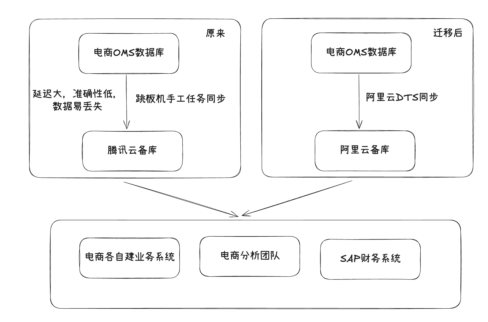

### 记录一次电商数据库迁移

#### 背景

在公司电商业务运营中，订单管理系统（OMS）作为核心，承载着订单、库存等关键业务流程。过去系统依赖通过跳板机建立的手工同步任务，将OMS数据库的数据同步至腾讯云的数据库

#### 现有问题

- **数据延迟大：** 手工同步无法满足业务对实时性的要求。
- **数据准确性低：** 人工操作容易出错，且缺乏有效的数据校验机制，难以保证数据的完整性和准确性。
- **影响业务系统功能：** 数据延迟可能导致业务系统无法及时获取最新的数据，影响其正常运作。
- **影响数据分析团队的数据质量：** 不准确和滞后的数据会直接影响数据分析结果的可靠性，阻碍业务决策。

#### 解决方案选型

针对不同的业务场景采取了差异化的迁移策略：**核心业务系统采用停服迁移**，而**下游各业务系统则采用直接迁移**的方式。

之所以对核心业务系统选择停服迁移，主要是因为这些系统不仅需要读取 OMS 数据库的原始数据，还需要对数据库中的**业务系统自建表**进行写入操作。这种读写并存的场景下，进行在线迁移的复杂度和数据一致性风险会大大增加。停服迁移能够确保在切换过程中数据的一致性，并为新旧系统的切换提供一个清晰的时间窗口。

与之不同的是，我们的下游各业务系统（例如电商分析团队）仅依赖于 OMS 数据库的原始数据，并不涉及对自建表的读写操作。因此，这些系统可以直接将数据源切换至阿里云数据库，无需经历停服

#### 迁移前的准备工作：

1. **获取源数据库 Binlog 配置：**
   - 确认源数据库（OMS数据库）已开启 Binlog 功能
   - 评估 Binlog 的保留策略，确保在迁移过程中有足够长的 Binlog 可用（这里与oms确认保留3天，保证初始化全量同步后，binlog能够接上）
2. **DBA配置阿里云数据传输服务（DTS）**
3. **全面的旧数据库账户收集与分析：**
   - **通知各相关业务方：** 发布数据库迁移通知，明确迁移时间和影响，并要求各业务方提供其使用的数据库账户信息。
   - **DBA 监测数据库连接 IP 与账户：** 通过数据库审计日志等方式，监控当前数据库的连接情况，识别所有正在访问数据库的系统、人员及其使用的账户。
   - **确定相关的使用系统、人员与账户：** 对收集到的信息进行整理和核对，形成完整的账户清单。
4. **阿里云数据库环境准备：**
   - **新建数据库和账户：** 在阿里云关系型数据库服务（RDS）上创建目标数据库实例，并根据账户清单创建相应的数据库账户，设置必要的权限。
   - **检查账户连接：** 确保所有新建账户能够从各自的业务系统或工具正常连接到阿里云数据库。
   - **创建自建表和相关视图：** 在阿里云数据库中创建与旧数据库结构相同的自建表，并创建相应的视图。

#### 开始迁移

1. **阿里云 DTS 全量数据同步：** 配置并启动阿里云 DTS 的全量数据同步任务，将腾讯云旧数据库的存量数据同步到阿里云数据库。
2. **阿里云 DTS 增量数据同步：** 在全量同步完成后，启动 DTS 的增量数据同步任务，持续同步旧数据库在停服期间产生的 Binlog 数据，以保证新旧数据库的数据实时一致性。
3. **下游系统切换读数据源：** 通知各下游系统先行将数据读取的数据源切换至阿里云数据库。
4. **写业务系统停止数据写入：** 在预定的停服时间，通知所有涉及数据写入的业务系统停止对旧数据库的所有写入操作。
5. 写业务系统切换数据源：将所有写业务系统的数据源切换至阿里云数据库。
6. **读业务系统切换数据源（针对需要读取自建表的系统）：** 对于需要读取自建表的业务系统，将其数据源切换至阿里云数据库。
7. **关闭历史同步服务器：** 停止运行之前用于手工同步数据的跳板机和相关任务。
8. **系统测试与验证：** 对所有相关的业务系统进行全面的功能测试和数据验证，确保数据读写正常，业务流程没有受到影响。重点验证自建表的数据写入和读取是否正常。
9. **关闭腾讯云数据库连接：** 在确认所有业务系统运行稳定后，逐步关闭对腾讯云旧数据库的外部连接。

#### 迁移后

1. **持续观察与监控：** 在迁移后的两周内，持续监控阿里云数据库的运行状态、性能指标以及旧数据库的连接情况，确认是否还有意外的访问。
2. **旧数据库资源回收：** 确认旧数据库没有任何业务依赖后，运维进行腾讯云数据库资源的回收，

### 总结与反思

在本次迁移过程中，我们深刻体会到以下几点：

- **充分的准备至关重要：** 细致的账户收集、完善的同步方案和周密的测试计划是成功迁移的基础。
- **停服迁移需要周密的协调：** 涉及到多个业务系统的停服和切换，需要提前与各团队充分沟通，制定详细的回滚预案。
- **监控和回滚预案不可或缺：** 迁移后的持续监控以及完善的回滚预案能够应对可能出现的突发情况。