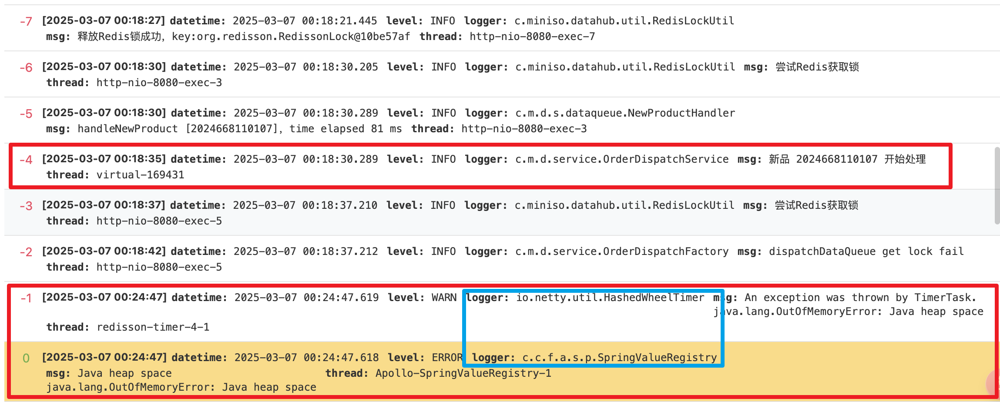
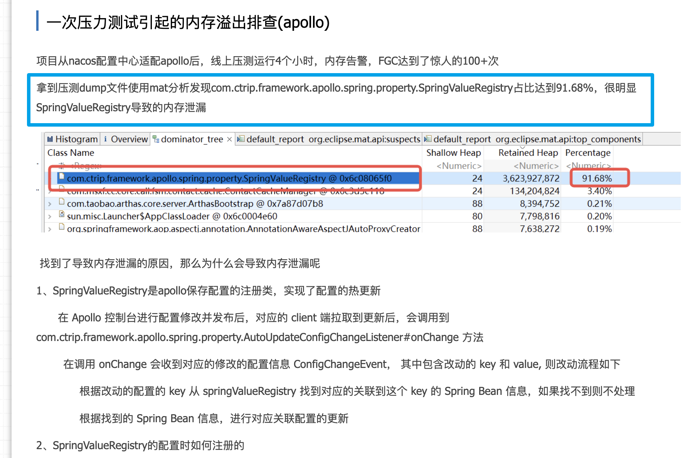

### 记录一次线上的OOM问题

#### 问题：

- 一早发现线上服务凌晨出现OOM告警,导致服务不可用重启了

#### 问题排查

- 该服务没有配置oom时下载dump，因此只能看日志一步一步排查

- 查看详细的sls日志发现，抛出oom的logger为redisson中获取数据库连接的netty和apoll的SpringValueRegistry，因此一开始怀疑是apollo的SpringValueRegistry问题

- 去查找原因的时候发现了以下这篇文章,发现确实也有SpringValueRegistry出现内存泄露的例子，但其原因是项目中用到了很多prototype模式bean，并且这些bean存在比较多的@Value注解，而每次bean创建的时候将Value注解的属性值并注册到SpringValueRegistry中，导致内存泄露。但我们项目中没有用到prototype模型的bean中，所以应该不是由于他引起的。

https://www.cnblogs.com/banzhuandang/p/17813206.html

- 然后日志中打印完新品开始处理的日志就oom了，因此去看相关打印该日志的相关代码(这里补充一下背景，这里是个对商品进行禁配解禁的服务，一个新品过来需要去进行禁配解禁的处理。

  

- 根据代码可以看到第二条日志没打印出来，而`查询“新品-单据-门店和仓”数据`是会个查出大量数据的sql，因此先尝试将该sql执行一下:`这个新品命中了2000w数据`，大概率就是他引起的了，应用大概分到内存是11G左右，这里的字段数据又比较多，一次性将数据加载进内存导致oom了

#### 疑惑：

- 如果是新品处理抛异常了，应该会打印出这个log才对，但是在sls并没有看到，而且logger也应该是这个类才对，真的是他导致的oom吗？

- 基于上述分析，极有可能是这条sql将数据加载进内存的时候，将要达到上限时候，刚好apollo需要用到内存，就导致异常是他抛出来的，但根因不是他导致的，还是由于新品逻辑加载了太多数据。
- 所以排查oom问题看谁抛出的参考意义有限
