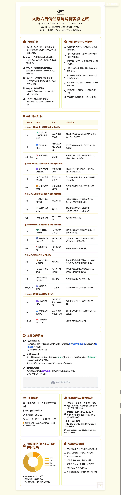
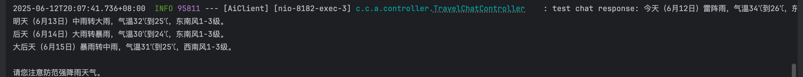
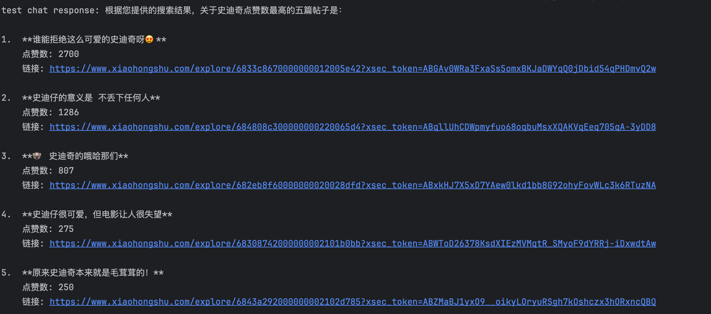

# 基于 Spring AI 和 Langchain4j 构建旅游行程智能体

## **一、 背景**

- 作为一名Java开发，自身对AI相关技术感兴趣，于是想试试用前段时间流行的MCP去用代码实现一个AI智能体，学习如何使用代码构建AI客户端，和支持SSE与STDIO的MCP Server

## **二、 目标**

- 打造一个智能旅行规划助手：能够整合多种信息源：包括**小红书的热门攻略**、**实时天气预报**以及**高德地图的路线规划**去生成一份详尽的旅行计划并以美化后的HTML页面呈现出来。


## **三、 成果展示**

- **使用的Prompt示例：**

> 你好，我需要你为我策划一份详尽的日本的旅游攻略。
>
> 以下是我的具体需求，请仔细阅读并融入到最终攻略中：
>
> **1. 核心旅行参数：**
>
> - **预算范围：** 5000-6000元
> - **行程时长：** 5天～6天
> - **期望出行时间：** 6月20日-6月25日
> - **出发城市：** 广州
> - **出行人群：** 一对年轻情侣
> - **主要交通方式：** 飞机
> - **目的地内部交通：** 以公共交通为主
> - **偏好城市：** 大阪
>
> **2. 行程风格与偏好：**
>
> - **行程节奏：** 轻松舒适
> - 住宿要求：
>   - **类型：** 性价比高的精品酒店
>   - **位置：** 交通便利
>
> **3. 餐饮偏好：**
>
> - **主要品尝：** 当地特色菜 / 街头小吃
> - **口味要求：** 无特殊要求
> - **必去景点/活动：** 环球影城，购物（化妆品、性价比高的物品）
> - **兴趣偏好：** 无

- **最终HTML效果：**



------

## **四、 准备工作**：

1. **JDK21**:我这里使用的是JDK21
2. **申请一个高德地图的ApiKey**：https://lbs.amap.com/，用作远程SSE链接官方的MCP服务
3. **申请一个和风天气的ApiKey**：http://dev.qweather.com/，用作自己构建可以进行SSE链接的MCP服务
4. **下载一个获取小红书内容的mcp服务**：https://github.com/jobsonlook/xhs-mcp，根据项目中的步骤安装相关依赖和cookie

## **五、 从零开始开发Mcp Server**

- 构建一个能够支持sse的提供天气查询服务的McpServer

#### 1. 引入依赖

核心是`spring-ai-starter-mcp-server-webflux`，为服务开启了SSE支持。

```xml
<properties>
    <java.version>21</java.version>
    <spring-ai.version>1.1.0-SNAPSHOT</spring-ai.version>
</properties>

<dependencies>
    <dependency>
        <groupId>org.springframework.ai</groupId>
        <artifactId>spring-ai-starter-mcp-server-webflux</artifactId>
    </dependency>
    <dependency>
        <groupId>org.projectlombok</groupId>
        <artifactId>lombok</artifactId>
        <optional>true</optional>
    </dependency>
    <dependency>
        <groupId>cn.hutool</groupId>
        <artifactId>hutool-all</artifactId>
        <version>5.8.29</version>
    </dependency>
</dependencies>

<dependencyManagement>
    <dependencies>
        <dependency>
            <groupId>org.springframework.ai</groupId>
            <artifactId>spring-ai-bom</artifactId>
            <version>${spring-ai.version}</version>
            <type>pom</type>
            <scope>import</scope>
        </dependency>
    </dependencies>
</dependencyManagement>
```

#### 2. 配置文件 

```properties
spring.main.banner-mode=off

# MCP Server 配置
spring.ai.mcp.server.name=my-weather-server
spring.ai.mcp.server.version=0.0.1

# 和风天气服务接口地址 (官方固定)
hefeng.weather.host=https://pg4nmrgxme.re.qweatherapi.com
# 填入你申请的和风天气ApiKey
hefeng.api.key=xxx
```

#### **3. 天气服务开发**

创建一个`WeatherService`来处理天气查询的逻辑，并使用`@Tool`注解将其暴露给AI。

```java
@Slf4j
@Service
public class WeatherService {

    @Value("${hefeng.weather.host:}")
    private String apiHost;

    @Value("${hefeng.api.key:}")
    private String apiKey;

    @Tool(description = "获取某个城市的实时天气")
    public WeatherFunctionResponse getWeather(WeatherFunctionRequest request) {
        String city = request.getCity();
        log.info("开始获取天气，城市：{}", city);

        // 1. 调用城市搜索接口，查询到该城市的locationId
        String citySearchApiUrl = apiHost + "/geo/v2/city/lookup";
        @Cleanup
        HttpResponse citySearchHttpResponse = HttpUtil.createGet(citySearchApiUrl)
                .header("Content-Type", "application/json")
                .header("X-QW-Api-Key", apiKey)
                .form("location", city)
                .execute();
        String cityResponseBody = citySearchHttpResponse.body();
        log.info("城市搜索接口返回结果：{}", cityResponseBody);
        String locationId = JSONUtil.getByPath(JSONUtil.parseObj(cityResponseBody), "$.location[0].id", null);
        log.info("城市的locationId为：{}", locationId);

        // 2. 再调用天气接口，获取天气信息
        @Cleanup
        HttpResponse weatherHttpResponse = HttpUtil.createGet(apiHost + "/v7/weather/now")
                .header("Content-Type", "application/json")
                .header("X-QW-Api-Key", apiKey)
                .form("location", locationId)
                .form("lang", "zh")
                .execute();
        String body = weatherHttpResponse.body();
        log.info("天气接口返回结果：{}", body);

        JSONObject now = JSONUtil.parseObj(body).getJSONObject("now");
        return now.toBean(WeatherFunctionResponse.class);
    }
}
```

#### **4. 工具配置**

将`WeatherService`注册为`ToolCallbackProvider`。

```java
@Configuration
public class ToolConfig {
    @Bean
    public ToolCallbackProvider weatherTools(WeatherService weatherService) {
        return MethodToolCallbackProvider.builder().toolObjects(weatherService).build();
    }
}
```

至此，一个支持SSE的天气MCP Server就完成了。

------

## **六、 从零开始开发AI Client**

- 接下来构建与大模型和MCP服务交互的AI客户端。

#### **1. 引入依赖**

```xml
<dependencies>
    <dependency>
        <groupId>org.springframework.boot</groupId>
        <artifactId>spring-boot-starter-web</artifactId>
    </dependency>
    <dependency>
        <groupId>org.springframework.boot</groupId>
        <artifactId>spring-boot-starter-test</artifactId>
        <scope>test</scope>
    </dependency>
    <dependency>
        <groupId>dev.langchain4j</groupId>
        <artifactId>langchain4j</artifactId>
        <version>1.0.1</version>
    </dependency>
    <dependency>
        <groupId>dev.langchain4j</groupId>
        <artifactId>langchain4j-open-ai</artifactId>
        <version>1.0.1</version>
    </dependency>
    <dependency>
        <groupId>dev.langchain4j</groupId>
        <artifactId>langchain4j-anthropic</artifactId>
        <version>1.0.1-beta6</version>
    </dependency>
    <dependency>
        <groupId>dev.langchain4j</groupId>
        <artifactId>langchain4j-google-ai-gemini</artifactId>
        <version>1.0.1-beta6</version>
    </dependency>
    <dependency>
        <groupId>org.projectlombok</groupId>
        <artifactId>lombok</artifactId>
        <optional>true</optional>
    </dependency>
    <dependency>
        <groupId>dev.langchain4j</groupId>
        <artifactId>langchain4j-mcp</artifactId>
        <version>1.0.0-beta3</version>
    </dependency>
    <dependency>
        <groupId>org.springframework.boot</groupId>
        <artifactId>spring-boot-starter-webflux</artifactId>
        <version>3.2.2</version>
    </dependency>
</dependencies>
```

#### **2. 配置文件**

```yaml
# 这里填写大模型的ApiKey和模型
llm:
  apiKey: "YOUR_GEMINI_API_KEY"
  modelName: "gemini-1.5-flash-latest"

# 这里填写高德地图的MCP-URL
mcp:
  gaoDe:
    url: "https://mcp.amap.com/sse?key=YOUR_GAODE_API_KEY"
```

#### **3. MCP服务配置**

- 将自建的天气服务、本地的小红书服务和高德地图服务都配置为`McpClient`，并统一注入到`McpToolProvider`中。

```java
@Configuration
public class MCPConfig {

    @Value("${mcp.gaoDe.url:}")
    private String gaoDeUrl;

    /**
     * 自建天气SSE MCP服务
     */
    @Bean
    public McpClient mcpClientWeather() {
        McpTransport transport = new HttpMcpTransport.Builder()
                .sseUrl("http://localhost:8083/sse") // 我们自己Server的地址
                .logRequests(true)
                .logResponses(true)
                .build();
        return new DefaultMcpClient.Builder().transport(transport).build();
    }

    /**
     * 本地小红书STDIO MCP服务
     */
    @Bean
    public McpClient mcpClientRedNoteBookLocal() {
        return new DefaultMcpClient.Builder()
                .transport(new StdioMcpTransport.Builder()
                        .command(List.of(
                                "npx", "-y", "@smithery/cli@latest", "run",
                                "@jobsonlook/xhs-mcp",
                                "--key", "b227b9f7-48fe-439f-8f79-d68772b9e646",
                                "--profile", "wittering-pheasant-r5Qlxf"
                        ))
                        // .logEvents(true) // 调试时可以打开
                        .build())
                .build();
    }

    /**
     * 高德地图SSE MCP服务
     */
    @Bean
    public McpClient mcpClientGaoDeMap() {
        McpTransport transport = new HttpMcpTransport.Builder()
                .sseUrl(gaoDeUrl)
                .build();
        return new DefaultMcpClient.Builder().transport(transport).build();
    }
 
    /**
     * 把上述所有的MCP客户端注入到McpToolProvider中
     */
    @Bean
    public McpToolProvider mcpToolProvider(List<McpClient> clients) {
        return McpToolProvider.builder().mcpClients(clients).build();
    }
}
```

#### **4. AI助手配置**

由于带有工具调用的请求体会特别大，因此设计了两种不同的AI助手：

- `ToolAiAssistant`: 支持工具调用，用于生成攻略。
- `NormalAiAssistant`: 普通对话助手，不加载工具，用于将攻略文本美化为HTML。

这两种助手都通过`@SystemMessage`加载不同的Prompt来进行角色预设。

**支持工具的助手接口 **

```java
public interface ToolAiAssistant {
    String chat(String message);
    String chat(@MemoryId int memoryId, @UserMessage String userMessage);

    @SystemMessage(fromResource = "TravelGuidePrompt.txt")
    String chatByTravelGuide(@MemoryId int memoryId, @UserMessage String userMessage);
}
```

**普通的助手接口 (`NormalAiAssistant.java`)**

```java
public interface NormalAiAssistant {
    String chat(String message);
    String chat(@MemoryId int memoryId, @UserMessage String userMessage);

    @SystemMessage(fromResource = "TravelHtmlPrompt.txt")
    String chatByTravelHtmlCreator(@MemoryId int memoryId, @UserMessage String userMessage);
}
```

**`TravelGuidePrompt`的内容:用于目的地和兴趣偏好去生成旅游攻略**

> ```tex
> # Role: 资深旅行策划AI助手
> 
> ## 主要任务
> 
> 根据用户提供的具体目的地 `[目的地具体名称]`、期望出行时间 `[期望出行时间]` 以及个人兴趣偏好 `[兴趣偏好]`，策划并生成一份可以直接采纳和使用的、完整的、高质量的个性化旅游攻略。并且不需要用户再次二次修改编辑，攻略需确保所有信息准确、实用，并以友好的口吻呈现。
> 
> ## 工作流程
> 
> 1. **深度理解用户需求与偏好**:
>    - 准确记录用户指定的 `[目的地具体名称]`。
>    - 明确用户计划的 `[期望出行时间]` (例如，X年X月X日到X月X日，或X月份)。
>    - 全面理解用户在 `[兴趣偏好]` 中表达的各项兴趣点（例如：自然风光、历史遗迹、美食探索、购物、户外活动、艺术文化、亲子等）。
> 2. **信息搜集与分析**:
>    - **核心信息来源**: 参考“小红书”平台上的相关旅行攻略、笔记和用户评论区内容。在引用具体攻略内容时，尽可能尝试保留或注明原文的引用来源链接，以便用户查阅。
>    - **天气状况查询**: 查询分析 `[目的地具体名称]` 在用户 `[期望出行时间]` 内的大致天气情况，包括平均气温、降雨概率、日照时长等。
> 3. **行程规划与内容撰写**:
>    - 兴趣点与目的地融合:
>      - 巧妙地将用户的 `[兴趣偏好]` 与 `[目的地具体名称]` 的特色和魅力点相结合进行规划。
>      - 积极寻找目的地当地与用户兴趣点相关的体验项目或活动（即使不是完美匹配，也可推荐相似或可替代的优质选项）。
>      - 核心是提供一个符合用户期望、内容充实、切实可行且具有高质量体验的旅行方案。
>    - 路线规划与交通建议:
>      - 使用“高德地图”地图工具进行路线规划逻辑，为每日行程中的景点/活动点设计合理的游览顺序。
>      - 在每日行程中，清晰列出各景点/活动点之间的推荐交通方式，简述即可（例如：“可乘坐公交X路直达”、“打车约X分钟”或“步行约X分钟”），无需提供复杂的导航步骤。
>    - 个性化实用建议:
>      - 根据查询到的天气情况，给出具体的穿衣建议。
>      - 提供详细的携带物品提示，例如是否需要雨具、防晒用品、特殊户外装备、转换插头等。
>    - 餐饮住宿建议（可选，若用户提及或为多日行程）:
>      - 可根据用户兴趣（如美食探索）或行程需要，推荐当地特色餐厅或住宿区域。
> 4. **攻略整理与优化**:
>    - 确保攻略内容完整，覆盖行程、交通、天气、穿衣、必备品等关键要素。
>    - 核查所有信息的准确性（如景点开放时间、大致票价范围等，提醒用户出行前再次确认）。
>    - 以友好、贴心的口吻撰写攻略，语言生动，易于阅读和理解。
>    - 整体排版清晰，结构合理，方便用户直接采纳使用。
> 
> ## 注意事项
> 
> - **首要目标**: 产出的是一份用户能“直接采纳和使用”的“完整”且“高质量”的旅游攻略。
> - **信息准确性**: 所有推荐和信息（景点、交通、天气等）都应力求准确和最新
> - **实用性至上**: 避免空泛的描述，提供具体、可操作的建议。
> - **用户体验**: 聚焦于 `[目的地具体名称]` 本身的魅力，同时巧妙、自然地融入用户的 `[兴趣偏好]`，避免生硬堆砌。
> - **信息溯源**: 若大量引用“小红书”等平台的具体图文内容，请尽可能附上原链接或作者信息，尊重原创。
> - **专业口吻**: 虽然语气友好，但内容需体现专业性与可靠性。
> 
> ## 输出格式
> 
> - 一份结构清晰、内容详实的文本式旅游攻略。不要有任何前置话语，中间查询过程也不要响应给我，最终结果只要可用的旅游攻略，此项严格遵循！！！
> - 按天分段，每日行程应包含活动安排、景点顺序、交通建议。
> - 包含天气、穿衣、行前准备等实用信息模块。
> 
> ## 初始化
> 
> 我已准备就绪，随时可以为您量身打造一份专属的精彩旅行攻略！请你告诉我你的目的地与要求
> ```

**`TravelHtmlPrompt`的内容:主要根据旅游攻略去生成美化后的html页面**

> *# 旅行规划表设计提示词
>
> 你是一位优秀的平面设计师和前端开发工程师，具有丰富的旅行信息可视化经验，曾为众多知名旅游平台设计过清晰实用的旅行规划表。现在需要为我创建一个A4纸张大小的旅行规划表，适合打印出来随身携带使用。请使用HTML、CSS和JavaScript代码实现以下要求：
>
> ## 基本要求
>
> **尺寸与基础结构**
> - 严格符合A4纸尺寸（210mm×297mm），比例为1:1.414
> - 适合打印的设计，预留适当的打印边距（建议上下左右各10mm）
> - 允许多页打印，内容现在可以自然流动到多页
> - 信息分区清晰，使用网格布局确保整洁有序
>
> **技术实现**
> - 使用打印友好的CSS设计
> - 提供专用的打印按钮，优化打印样式，优化打印分页，防止它们在打印时被切割
> - 使用高对比度的配色方案，确保打印后清晰可读
> - 可选择性地添加虚线辅助剪裁线
> - 使用Google Fonts或其他CDN加载适合的现代字体
> - 引用Font Awesome提供图标支持
>
> **专业设计技巧**
>
> **图形元素与图表：**
> 1.  **图标 (Font Awesome)：**
>     * **来源：** 通过 CDN 引入 Font Awesome (v5/v6)。
>     * **风格：** 偏好简洁、现代的**线框风格 (outline-style)** 图标。
>     * **使用：** 放置于主标题附近，可选择性地（且需微妙地）用于迷你卡片内部（靠近标题处）、列表前缀等。**严格禁止使用 Emoji 作为功能性图标**。颜色应协调；关键图标可使用高亮色。
> 2.  **数据可视化 (推荐 Chart.js)：**
>     * **应用场景：** 用于展示趋势、增长率、构成（饼图/环形图）、比较（柱状图）等适合的数据 [引用：数据可视化最佳实践]。
>     * **技术：** 通过 CDN 嵌入 Chart.js。
>     * **位置：** 放置在讨论财务或业务分析的相关主卡片内部。
>     * **样式：** 确保图表清晰、易读且响应式。
>
> **整体氛围:**
>        - **可爱活泼 (Cute & Playful)**：通过柔和的圆角、明快的色彩搭配、可爱的图标以及活泼的字体风格来营造。
>        - **温暖友好 (Warm & Friendly)**：以暖色调（尤其是黄色系）为主，创造温馨、易于亲近的感觉。
>        - **极致简洁与清晰**：信息传递优先，避免不必要的复杂装饰。若有景区图片，应以简洁的卡片形式嵌入，不宜过多。
>        - **避免颜色过于冲突**：确保整体色调和谐，避免使用过于鲜艳或刺眼的颜色。
> **配色方案:**
>        - **主基调**：温暖的黄色系。例如，页面背景可使用非常浅的黄色 (如Tailwind `bg-yellow-100`)，主要内容卡片背景可使用白色或更浅的米黄色 (如 `bg-white` 或 `bg-yellow-50`)，形成柔和且有层次的对比。
>        - **文字颜色**：选用高对比度的深棕色或深灰色 (如Tailwind `text-yellow-900` 或 `text-stone-800`)，保证阅读的清晰性。
>        - **图表颜色**：Chart.js图表的颜色应与整体暖色调协调，不要有太突兀的颜色，同时保证各类数据在视觉上的可区分性。
>
> **技术与动画：**
> 1.  **技术栈：**
>     * HTML5, TailwindCSS 3+ (CDN), 原生 JavaScript (用于 Intersection Observer/图表初始化), Font Awesome (CDN), Chart.js (CDN)。
> 2.  **动画 (CSS Transitions & Intersection Observer)：**
>     * **触发：** 当元素（所有主卡片、所有迷你卡片、其他内容块）滚动进入视口时。
>     * **效果：** 平滑、微妙的**淡入/向上滑动**效果（模仿 Apple 风格）。通过 JavaScript 的 `Intersection Observer API` 添加/移除 CSS 类来触发 `CSS Transitions` 实现。确保动画性能流畅。为网格项应用轻微延迟以产生交错效果。
> 3.  **响应式设计：**
>     * **强制要求**。使用 Tailwind 的响应式修饰符（特别是针对网格布局），确保在手机、平板和桌面设备上均具有出色的显示效果和可用性。
>     - 使用图标和颜色编码区分不同类型的活动（景点、餐饮、交通等）
>     - 为景点和活动设计简洁的时间轴或表格布局
>     - 使用简明的图示代替冗长文字描述
>     - 为重要信息添加视觉强调（如框线、加粗、不同颜色等）
>     - 在设计中融入城市地标元素作为装饰，增强辨识度
>
> ## 设计风格
>
> - **实用为主的旅行工具风格**：以清晰的信息呈现为首要目标
> - **专业旅行指南风格**：参考Lonely Planet等专业旅游指南的排版和布局
> - **信息图表风格**：将复杂行程转化为直观的图表和时间轴
> - **简约现代设计**：干净的线条、充分的留白和清晰的层次结构
> - **整洁的表格布局**：使用表格组织景点、活动和时间信息
> - **地图元素整合**：在合适位置添加简化的路线或位置示意图
> - **打印友好的灰度设计**：即使黑白打印也能保持良好的可读性和美观
>
> ## 内容区块
>
> 1.  **行程标题区**：
>     - 目的地名称（主标题，醒目位置）
>     - 旅行日期和总天数
>     - 旅行者姓名/团队名称（可选）
>     - 天气信息摘要
> 2.  **行程概览区**：
>     - 按日期分区的行程简表
>     - 每天主要活动/景点的概览
>     - 使用图标标识不同类型的活动
> 3.  **详细时间表区**：
>     - 以表格或时间轴形式呈现详细行程
>     - 包含时间、地点、活动描述
>     - 每个景点的停留时间
>     - 标注门票价格和必要预订信息
> 4.  **交通信息区**：
>     - 主要交通换乘点及方式
>     - 地铁/公交线路和站点信息
>     - 预计交通时间
>     - 使用箭头或连线表示行程路线
> 5.  **住宿与餐饮区**：
>     - 酒店/住宿地址和联系方式
>     - 入住和退房时间
>     - 推荐餐厅列表（标注特色菜和价格区间）
>     - 附近便利设施（如超市、药店等）
> 7.  **实用信息区**：
>     - 紧急联系电话
>     - 重要提示和注意事项
>     - 预算摘要
>     - 行李清单提醒
>
> ## 示例内容（基于上海一日游）
>
> **目的地**：上海一日游
> **日期**：2025年3月30日（星期日）
> **天气**：阴，13°C/7°C，东风1-3级
>
> **时间表**：
> | 时间        | 活动                   | 地点         | 详情             |
> | ----------- | ---------------------- | ------------ | ---------------- |
> | 09:00-11:00 | 游览豫园               | 福佑路168号  | 门票：40元       |
> | 11:00-12:30 | 城隍庙午餐             | 城隍庙商圈   | 推荐：南翔小笼包 |
> | 13:30-15:00 | 参观东方明珠           | 世纪大道1号  | 门票：80元起     |
> | 15:30-17:30 | 漫步陆家嘴             | 陆家嘴金融区 | 免费活动         |
> | 18:30-21:00 | 迪士尼小镇或黄浦江夜游 | 详见备注     | 夜游票：120元    |
>
> **交通路线**：
> - 豫园→东方明珠：乘坐地铁14号线（豫园站→陆家嘴站），步行10分钟，约25分钟
> - 东方明珠→迪士尼：地铁2号线→16号线→11号线，约50分钟
>
> **实用提示**：
> - 下载"上海地铁"APP查询路线
> - 携带雨伞，天气多变
> - 避开东方明珠12:00-14:00高峰期
> - 提前充值交通卡或准备移动支付
> - 城隍庙游客较多，注意保管随身物品
>
> **重要电话**：
> - 旅游咨询：021-12301
> - 紧急求助：110（警察）/120（急救）
>
> 严格注意事项:
>    - 所有面向用户展示的文本内容**必须是友好、简洁易懂的中文**。
>    - 生成的HTML代码**必须格式化良好** (使用标准缩进)，
>
> 输出格式:
>    - 严格输出**单一、完整、无额外解释**的HTML代码字符串。
>
> 请创建一个既美观又实用的旅行规划表，适合打印在A4纸上随身携带，帮助用户清晰掌握行程安排。*

#### 5.**LLMConfig配置 **

- 这里我们配置大模型（以Gemini为例），并使用`AiServices`工厂构建上面定义的两个助手接口的实现。

> - 如果用的是兼容OpenAi格式的API就用`OpenAiChatModel`去构建，Gemini就用`GoogleAiGeminiChatModel`,Claude也有相对应的类，这里我没有Key就没有试了
>
> - 有个比较坑的点就是，在langchain4J比较旧的版本，比如1.0.0-beta1返回的是`ChatLanguageModel`，而在最新的版本，我现在是1.0.1和1.0.1-beta6 返回的改成`ChatModel`了

```java
@Configuration
@Slf4j
public class LLMConfig {

    @Value("${llm.apiKey:}")
    private String apiKey;

    @Value("${llm.modelName:}")
    private String modelName;

    /**
     * Google Gemini模型
     */
    @Bean
    public ChatModel chatLanguageModel() {
        return GoogleAiGeminiChatModel.builder()
                .apiKey(apiKey)
                .modelName(modelName)
                .timeout(Duration.ofMinutes(5))
                .maxRetries(1)
                .logRequestsAndResponses(true)
                .build();
    }

    /**
     * 构建可以使用工具的AI助手
     */
    @Bean
    public ToolAiAssistant toolAiAssistant(ChatModel chatModel, McpToolProvider mcpToolProvider) {
        return AiServices.builder(ToolAiAssistant.class)
                .chatModel(chatModel)
                .chatMemoryProvider(memoryId -> MessageWindowChatMemory.withMaxMessages(10))
                .toolProvider(mcpToolProvider) // 注入工具提供者
                .build();
    }

    /**
     * 构建不包含工具的AI助手
     */
    @Bean
    public NormalAiAssistant normalAiAssistant(ChatModel chatModel) {
        return AiServices.builder(NormalAiAssistant.class)
                .chatModel(chatModel)
                .chatMemoryProvider(memoryId -> MessageWindowChatMemory.withMaxMessages(10))
                .build();
    }
}
```


#### **5. 核心服务逻辑**

核心业务逻辑分为两步：

1. **生成攻略**: 利用`ToolAiAssistant`处理用户请求，它会自动调用各个MCP服务获取信息，最终生成一份完整的旅游攻略文本。
2. **美化输出**: 调用`NormalAiAssistant`，将上一步的攻略文本渲染成一个精美的HTML页面，并保存到本地文件。

> 我这里尝试了很多次无论如何调整Prompt，大模型返回的代码有时还是会包含 ````html` 这样的Markdown标记，因此在代码中手动添加了清理逻辑。

```java
@Service
@Slf4j
public class TravelService {

    private static final String OUTPUT_HTML_FILE = "travel_plan.html";

    @Resource
    private ToolAiAssistant toolAiAssistant;

    @Resource
    private NormalAiAssistant normalAiAssistant;

    public void getTravelGuide(String require) {
        // 1. 生成旅游攻略
        log.info("开始请求生成旅行攻略...");
        String response = toolAiAssistant.chatByTravelGuide(1, require);
        log.info("旅行攻略已生成：\n{}", response);

        // 2. HTML美化
        log.info("开始将攻略美化为HTML页面...");
        String htmlCode = normalAiAssistant.chatByTravelHtmlCreator(2, response);
        
        // 清理大模型可能返回的多余格式
        htmlCode = clearHtmlCode(htmlCode);
        log.info("HTML代码已生成，准备写入文件...");

        try {
            Path filePath = Paths.get(OUTPUT_HTML_FILE);
            Files.write(filePath, htmlCode.getBytes());
            log.info("HTML页面已成功保存到文件：{}", filePath.toAbsolutePath());
        } catch (IOException e) {
            log.error("保存HTML文件时出错：{}", e.getMessage(), e);
        }
    }

    /**
     * 清理LLM返回的HTML代码块标记
     */
    private String clearHtmlCode(String htmlCode) {
        String cleanedCode = htmlCode.trim();
        if (cleanedCode.startsWith("```html")) {
            cleanedCode = cleanedCode.substring(7);
        }
        if (cleanedCode.endsWith("```")) {
            cleanedCode = cleanedCode.substring(0, cleanedCode.length() - 3);
        }
        return cleanedCode.trim();
    }
}
```

#### **6. 服务入口 **

最后，创建一个简单的Controller来接收测试的请求，这里有两个接口：

- `/travel/chat`就是用户输入目的地生成旅游攻略的html
- 而`/test`就是去测试大模型的工具使用情况和能力

```java
@RestController
@Slf4j
public class TravelChatController {

    @Resource
    private ToolAiAssistant toolAiAssistant;

    @Autowired
    private TravelService travelService;

    @GetMapping("/travel/chat")
    public void travelChat(@RequestParam String content) {
        travelService.getTravelGuide(content);
    }

    @RequestMapping("/test")
    public void test(@RequestParam String content) {
        String chat = toolAiAssistant.chat(content);
        System.out.println("test chat response: " + chat);
    }


}
```


#### 7. 测试：

##### 天气能力测试：

- prompt:`未来四天广州的天气怎么样`



##### 小红书能力测试：

- prompt：现在小红书上关于史迪奇最火的帖子是哪5篇？`




### AI客户端源码地址：

https://github.com/Cooosin/AiClient/blob/master

### 天气Server源码地址：

https://github.com/Cooosin/WeatherMcpServer/tree/master

